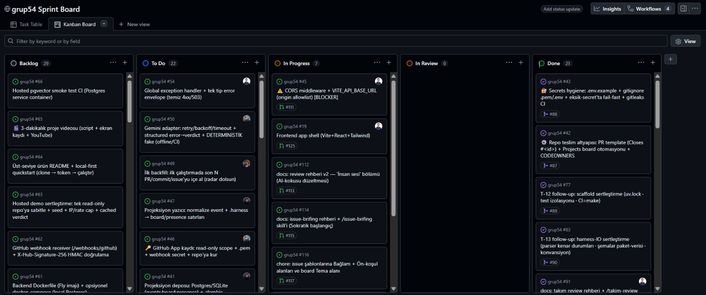
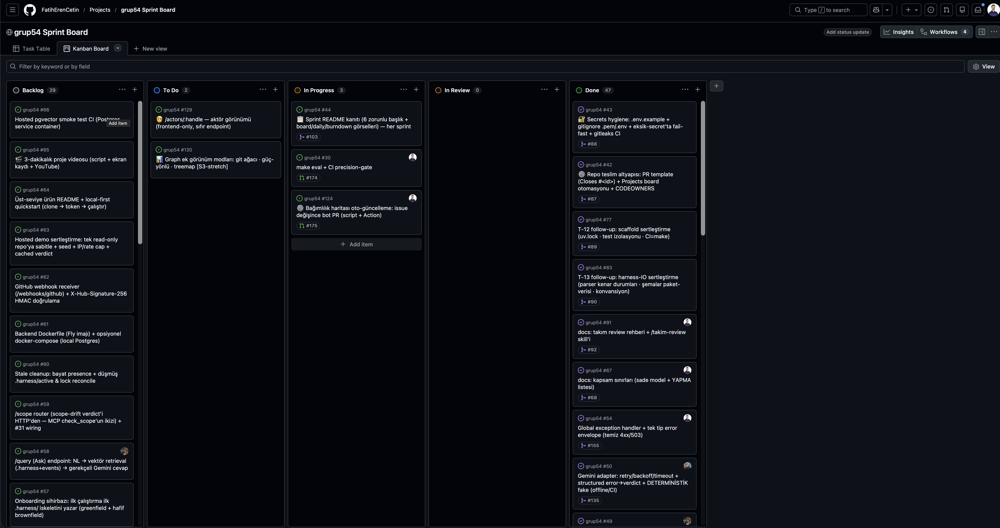
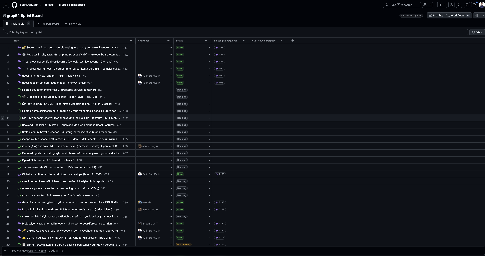
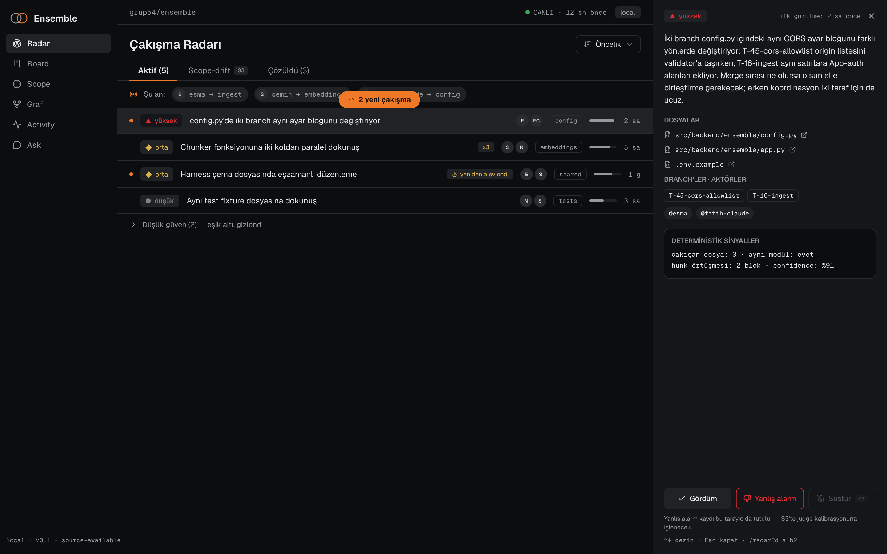
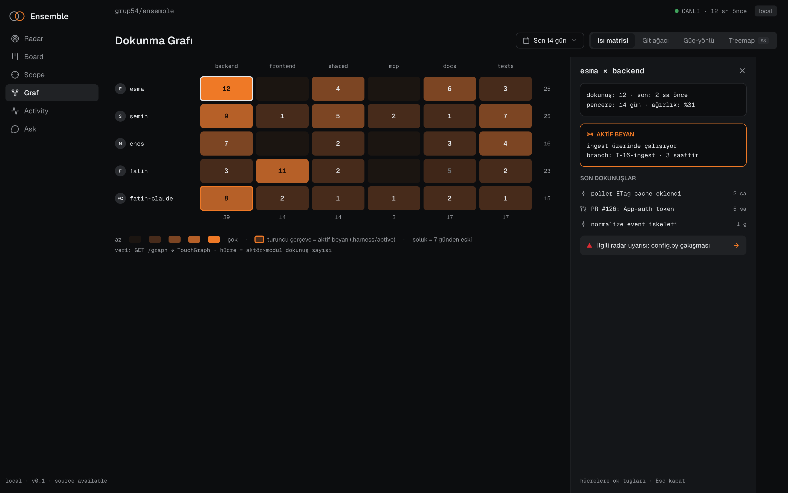
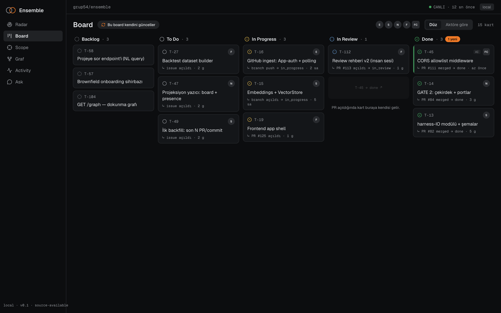
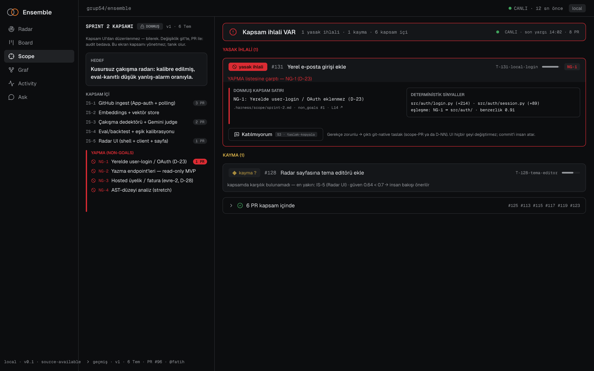
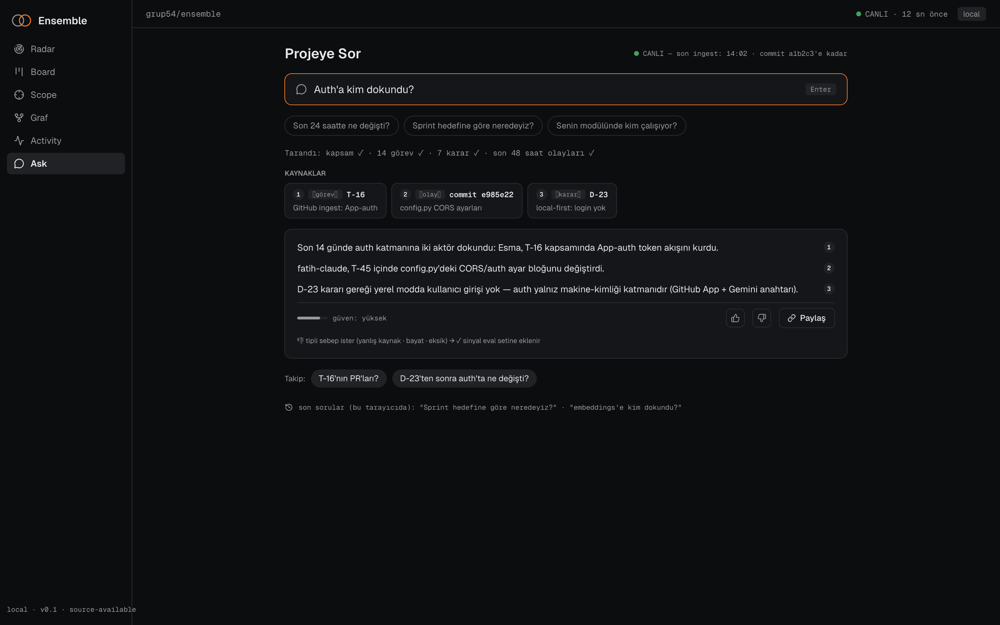
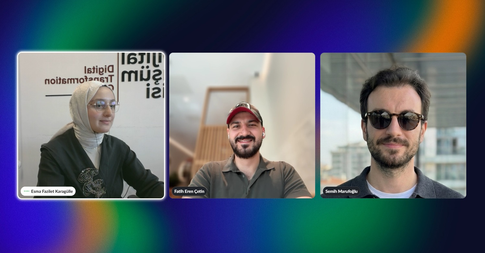
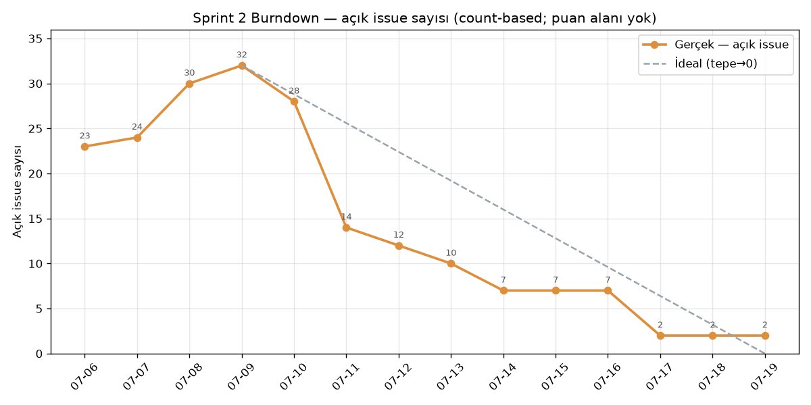

<!-- PUBLIC README — canlı reponun (FatihErenCetin/grup54) köküne koy, mevcut ŞABLON README'nin yerine. -->

# **Grup 54**

<div align="center">

### 🧭 Ensemble — Paylaşılan Proje Beyni

**AI çağı yazılım ekipleri için koordinasyon aracı:** kim neye dokunuyor, kimler çakışmak üzere, nerede plandan sapıldı — ve panoya **doğal dille sor**. Hepsi tek canlı ekranda, gerçek GitHub verisinden.

[**▶ İlk prototipi çalıştır**](harness-dashboard/README.md#çalıştırma) · YZTA Bootcamp 2026 · **grup54**


> **İlk prototip:** [`harness-dashboard/`](harness-dashboard/) — vizyonun çalışan bir kesiti. Ensemble'ın tam mimarisi (FastAPI engine · Gemini/Ollama "judge" · MCP · `.harness/`) geliştiriliyor.

</div>

---

# Ürün İle İlgili Bilgiler

## Takım Elemanları

| | İsim | Rol | GitHub | LinkedIn |
|:---:|---|---|:---:|:---:|
|  | **Fatih Eren Çetin** | Product Owner · Developer | [@FatihErenCetin](https://github.com/FatihErenCetin) | [in/fatih-eren-cetin](https://www.linkedin.com/in/fatih-eren-cetin/) |
|  | **Esma Fazilet Karagülle** | Scrum Master · Developer | [@esma6](https://github.com/esma6) | [in/esma-karagulle](https://www.linkedin.com/in/esma-karagulle/) |
|  | **Enes Talha Erdem** | Developer | [@EnesErdemT](https://github.com/EnesErdemT) | [in/enesterdem](https://www.linkedin.com/in/enesterdem/) |
|  | **Semih Marufoğlu** | Developer | [@asmarufoglu](https://github.com/asmarufoglu) | [in/asmarufoglu](https://www.linkedin.com/in/asmarufoglu/) |

> Roller bootcamp boyunca sabittir; **PO ve SM dahil herkes kod yazar.** Ekip içi iletişim kuralı: birincil **SM (Esma)**, yedek **PO (Fatih)**.

---

## Ürün İsmi

**Ensemble** *(çalışma adı)* — AI çağı yazılım ekipleri için paylaşılan proje beyni. İlk prototipin çalışma adı: *harness*.

## Ürün Açıklaması

Bir ekip hızlandıkça — özellikle herkes kendi AI asistanıyla kod yazarken — kimin ne yaptığını takip etmek zorlaşır: aynı iş tekrarlanır, insanlar birbirinin koduna dokunup çakışır, iş kapsamın dışına taşar. **Ensemble**, ekibin GitHub'daki **canlı** çalışmasını izleyip bunları tek ortak panoda gösterir. *(Sahte/mock veri yok — gerçek branch, PR ve issue'lar okunur.)*

## Ürün Özellikleri

- **🎯 Çakışma radarı** — aynı dosyaya dokunan birden fazla branch'i, merge çakışması yaşanmadan **önce** yakalar.
- **👀 Kim neye dokunuyor** — her branch'in son commit'i, yazarı, mesajı canlı.
- **📋 Kendiliğinden dolan sprint board** — issue/PR'lar otomatik Backlog → Devam → İncelemede → Bitti.
- **🛡️ Kapsam bekçisi** — issue'ya bağlı olmayan PR'ları işaretler (plan dışı işi görünür kılar).
- **💬 Beyne sor** — doğal dille soru, repo'nun gerçek verisinden yanıt.


▶ Çalıştırma (tek dosyalık HTML, kurulum yok) ve tüm detaylar: **[`harness-dashboard/README.md`](harness-dashboard/README.md)**

## Hedef Kitle

- Küçük yazılım ekipleri (özellikle AI destekli kod yazan)
- Öğrenci / bootcamp ekipleri
- Birden çok kişinin **ve AI aracının** aynı repoda paralel çalıştığı her takım
- **Tek geliştirici, aynı anda birden çok AI aracı/ajan çalıştıran** (solo multi-agent)

---

## 🧠 Mimari & Yapay Zeka

Ensemble, **insanların** (web pano) ve **her üyenin AI aracının** aynı paylaşılan bağlamı görmesi için tasarlandı. Yapay zekâ bir süs değil, ürünün karar katmanı. İki katman var — karıştırmamak için ayrı tablolar:

**1) İlk prototip — [`harness-dashboard/`](harness-dashboard/)** *(tek-dosya HTML; canlı GitHub verisiyle bugün çalışıyor — vizyonun kanıtı)*

| Yetenek | Durum |
|---|---|
| Çakışma radarı — **dosya-kesişimi** tespiti | 🟢 prototipte çalışıyor |
| Kendiliğinden dolan board + kapsam bekçisi | 🟢 prototipte çalışıyor |
| Beyne sor — kurallı mod (anahtarsız) | 🟢 prototipte çalışıyor |
| Beyne sor — AI modu (opsiyonel anahtar) | 🟢 prototipte çalışıyor |

**2) Ensemble motoru — hedef mimari** *(Sprint 1'de iskelet kuruldu; zekâ Sprint 2'de doluyor)*

| Bileşen | Durum |
|---|---|
| FastAPI engine iskeleti — `/health` · `/radar` · `/scope` · `/board` · `/query` endpoint'leri + port/adapter katmanı | 🟢 iskelet çalışıyor (22 test, CI) — **iş mantığı henüz yok, S2'de** |
| `.harness/` IO — `HarnessPort` (şema doğrulamalı okuma/yazma) | 🟢 çalışıyor |
| **Semantik çakışma + scope-drift** — embeddings + Gemini/Ollama **"judge"** + eşik kalibrasyonu/eval | 🔨 Sprint 2 (geliştiriliyor — ürünün kalbi) |
| GitHub ingest — App auth + polling | 🔨 Sprint 2 |
| React web pano (Radar · Board · Ask) | 🔨 Sprint 2 |
| **MCP arayüzü** — AI araçları ortak bağlamı okur/yazar | 🟡 Sprint 3 |
| Hosted demo (+ long-reach: üyelik) | 🟡 Sprint 3 |

Hedeflenen motor: **Python + FastAPI** (engine) · **Gemini veya Ollama** (embeddings + judge) · **MCP server** · **GitHub App** (webhook). Çalışma modu local-first; demo için tek hosted örnek.

### Tam-yerel gizlilik modu (Ollama)

`LLM_PROVIDER=ollama` seçildiğinde hem embeddings hem judge yerel Ollama API'sini
kullanır; Gemini anahtarı tanımlı olsa bile buluta geri düşmez. `ENSEMBLE_MODE`
ayrı bir ayardır: local modda Gemini, hosted modda aynı makinedeki Ollama da
seçilebilir.

Yerel judge hibrittir: kalibre actor/dosya-kesişimi/semantic similarity sinyalleri
açık vakaları deterministik sonuçlandırır; yalnız gri vakalar `llama3.2` structured
output yoluna gider. Her iki yol da yereldir ve repo bağlamı makineden çıkmaz.

```bash
ollama pull nomic-embed-text
ollama pull llama3.2
```

Ardından `.env` içinde `LLM_PROVIDER=ollama` ayarla ve normal şekilde `make dev`
çalıştır. Varsayılan endpoint `http://127.0.0.1:11434` ile loopback'e sabittir;
repo bağlamı makineden çıkmaz. Canlı provider kalibrasyonu aynı fixture'larla
`make eval-provider PROVIDER=ollama` komutundan koşar.

---

## 💼 İş Modeli

Tam **Yalın Kanvas** (9 blok) — vizyon + rakip araştırmasından damıtıldı:

[](ProjectManagement/General/yalin-kanvas.md)

> **Özet:** **Source-available çekirdek** (kaynak görünür, kullanım kısıtlı — OSI open source *değil*; PolyForm Strict) + hosted Team ≈ $8–12/geliştirici/ay · **open-core = doğrulama sonrası gelecek opsiyonu 💡** (relicense yolu açık) · hedef = AI-destekli küçük ekipler (öğrenci/bootcamp = dogfood köprübaşı) · **rekabet avantajı** = 4 koordinasyon parçasının (proaktif çakışma + canlı scope-drift + insan & ajan ortak farkındalık + git-yazılabilir `.harness/`) birleşimi — birebir rakip yok. Detay: [`yalin-kanvas.md`](ProjectManagement/General/yalin-kanvas.md).

---

## Product Backlog URL

[**GitHub Projects — grup54 Sprint Board**](https://github.com/users/FatihErenCetin/projects/1) *(public — issue/PR durumundan kendiliğinden dolar; ürünün "kendiliğinden dolan board" vaadinin dogfood'u)*

> Sprint raporları aşağıdadır (**tek-durak**: 6 başlık + görsel kanıtlar bu sayfada). Kanıt dosyaları: [`ProjectManagement/`](ProjectManagement/) · [kanıt haritası](ProjectManagement/README.md).

---

# Sprint 1

> **Tarih:** 19 Haziran – 5 Temmuz 2026 · **Takım:** grup54 (PO Fatih Eren Çetin · SM Esma Fazilet Karagülle · Dev Enes Talha Erdem · Dev Semih Marufoğlu) · **Ürün:** Ensemble — AI-çağı yazılım ekipleri için "paylaşılan proje beyni" (proaktif çakışma radarı · canlı scope-drift bekçisi · kendiliğinden dolan board · doğal dille "projeye sor").

- **Sprint Notları**:

**Sprint hedefi:** Ensemble'ın temelini atmak. Bu sprintte üç şeye odaklandık: (1) ürün vizyonunu **çalışan bir UI prototipiyle** somutlaştırmak, (2) ekibin paralel çalışabilmesi için **repo omurgasını ve süreç sözleşmelerini** kurmak, (3) AI çekirdeğinin üzerine inşa edileceği **kod temelini (foundation)** başlatmak. Sprint 1 kasıtlı olarak **kapsam + iskelet + ilk kanıt** sprintidir; ağır AI çekirdeği Sprint 2'ye planlanmıştır (bkz. Backlog Dağıtma Mantığı).

**Tahmin edilen puan:** hedef 10/10 (tam puan) — ekibin her sprintteki hedefi eksiksiz değerlendirme; gerçekleşen puan bootcamp değerlendirmesiyle netleşecek (bkz. Sprint Review).

**Bu sprintte alınan teknik/süreç kararları (kısa özet)**

- **Ürün adı = Ensemble.** Konumlandırma: local-first "paylaşılan proje beyni".
- **Değerlendirme kategorisi = YZ (Yapay Zeka).** Yapay zeka öğeleri en büyük puan kaldıracı olduğu için yol haritası buna göre önceliklendirildi.
- **Mimari yön = local-first (A).** Çok-kullanıcılı/bulut senaryosu (B) bootcamp sonrasına bırakıldı. Ortak bağlam repo içi `.harness/`'ta tutulur (git-senkron); Gemini embeddings + LLM judge ile çalışır; yığın FastAPI + React + MCP.
- **İlk dedektör = çakışma radarı.** Dosya-kesişimi sinyaliyle başlanır; scope-drift ve diğer dedektörler sonraki sprintlere planlandı.
- **Süreç sözleşmesi = `AGENTS.md` + `CONTRIBUTING`.** Git kuralı: `T-<id>` branch · `Closes #<id>` · merge commit · Conventional-lite mesaj · yazar = işi fiilen yapan kişi. Issue/story yönetimi şablona bağlandı (label: story = 🔵, task = 🔴; milestone = sprint; epic = alan).
- **Board aracı = GitHub Projects** (Backlog · To Do · In Progress · In Review · Done + otomasyon), görsel ayna olarak **Miro** kanban.
- **Daily ritmi = geliştirme günlerinde, async** (WhatsApp + Slack birlikte, async — sabit saat yok).

**User story'ler nerede tutuluyor:** Tüm user story ve task'lar **GitHub Issues**'ta yönetilir. Story'ler "*Bir <rol> olarak <istek> istiyorum, böylece <fayda>*" formatında yazılır; story/task label'ı taşır ve ilgili **sprint milestone**'una bağlanır. Sprint 1 backlog'u 5 epic (engine · ai · mcp · frontend · infra) → 32 story → ~150 task olarak yapılandırıldı ve süzülerek **58 GitHub issue**'ya indirgendi (backlog kuruluşu, 30 Haz; sonraki süreç/takip issue'larıyla toplam bugün ~73).

**Kullanılan araçlar:**

| Araç | Kullanım |
|---|---|
| **GitHub** | Repo, Issues (user story / backlog), Projects (kanban board + otomasyon) |
| **Miro** | Board'un görsel ayna kanbanı |
| **WhatsApp** | Günlük scrum (daily, async (sabit saat yok)) — kanıt `ProjectManagement/Sprint1/DailyScrum/` |
| **AI araçları** (Claude Code vb.) | AI-destekli geliştirme + backlog/doküman taslaklama |

> Çalışan ürün (UI prototipi) ekran görüntüleri: `ProjectManagement/Sprint1/Screenshots/` · Board görselleri ve renk kodu: `ProjectManagement/Sprint1/Board/`

---

- **Backlog düzeni ve Story seçimleri**:

Ürün backlog'umuz, ürünü dört çekirdek özelliğe (çakışma radarı · scope-drift bekçisi · kendiliğinden dolan board · "projeye sor") indirip bunları **5 epic** altında topladıktan sonra oluştu: `engine` · `ai` · `mcp` · `frontend` · `infra`. Bu epic'ler önce 32 story'ye, ardından ~150 task'a bölündü; coverage audit ("bağlantı dokusu" boşlukları: CORS, projeksiyon yazıcı, GitHub App kaydı, eval vb.) sonrası süzülerek **58 GitHub issue** olarak işaretlendi. Story'ler **GitHub Issues** üzerinde "Bir `<rol>` olarak `<istek>` istiyorum, böylece `<fayda>`" formatında tutuluyor; her issue `story` (🔵) / `task` (🔴) label'ı, `sprint` milestone'u ve `epic` (alan) etiketi taşıyor.

**Üç sprinte dağıtım gerekçesi**

Dağıtımı **değerlendirme kaldıracı** (YZ kategorisi: yapay zeka öğeleri 35p) ile **teknik bağımlılık sırası** (önce çalışan zemin, sonra çekirdek, sonra kabuk) birlikte belirledi:

- **Sprint 1 — Foundation + prototip + süreç (bu sprint).** Önce ortak zemini sağlamlaştırdık: repo omurgası (README · AGENTS.md · CONTRIBUTING · issue/story yönetimi), backlog'un kendisi (5 epic → 58 issue + roadmap + Sprint-2 kontratları + kapsam-sınırları), board otomasyonu ve ilk çalışan UI prototipi. **Gerekçe:** AI çekirdeği (S2) `.harness/` IO ve saf çekirdek (pure core) üzerine kurulacağı için bu katman erken bitmeli; ayrıca disiplinli git/board akışını kurmak, sonraki iki sprintin "kendiliğinden dolan board" vaadini kendi repomuzda dogfood etmemizi sağlıyor. GATE 0/1/2 (#12 scaffold → #13 harness-IO → #14 pure core) sıralı şekilde bu sprint içinde tamamlanacak.
- **Sprint 2 — AI çekirdeği (en yüksek kaldıraç).** Çakışma radarının uçtan uca yapay zeka hattı: ingest → embeddings → LLM judge → eval/kalibrasyon. **Gerekçe:** Final değerlendirmede "yapay zeka öğeleri" **35 puan**, ön değerlendirmede YZ modeli seçimi (20) + AI agent/hafıza/orkestrasyon (15) bulunuyor; toplam ~70 puanlık alan doğrudan bu çekirdeğe bakıyor. Bu yüzden en ağır ve en riskli iş, zemin oturduktan hemen sonra ortaya alındı — "süs AI" değil, amaca uygun ve kalibre edilmiş bir dedektör hedefleniyor.
- **Sprint 3 — Kabuk + tamamlama + sunum.** Board/ask kabuğu, scope-drift bekçisi, MCP entegrasyonu, hosted demo ve 3 dakikalık video. **Gerekçe:** Bunlar S2'deki çekirdeğin üzerine oturan kullanıcı-değeri ve sunum katmanı; çekirdek çalışmadan cilalanması anlamsız olurdu, bu yüzden en sona bırakıldı.

**Dağıtım kuralı**

Story bazında tahmini puan **sprint hedefinin yarısını geçmeyecek** şekilde bölündü; böylece tek bir story'nin sprinti domine etmesi engellenip risk dağıtıldı. Hedef vs gerçekleşen puan her sprint sonunda açıkça yazılıyor.

**Hedef vs Gerçekleşen (puan)**

| Sprint | Odak | Hedef puan | Gerçekleşen puan |
|---|---|---|---|
| Sprint 1 | Foundation + prototip + süreç | 10/10 (tam puan) | bootcamp değerlendirmesi bekleniyor |
| Sprint 2 | AI çekirdeği (çakışma radarı + eval) | 10/10 (tam puan) | planlandı — sprint sonunda doldurulacak |
| Sprint 3 | Kabuk + scope-drift + MCP + demo/video | 10/10 (tam puan) | planlandı — sprint sonunda doldurulacak |
| **Toplam backlog** | 5 epic → 58 issue | — (özet satır; puan sprint bazında değerlendirilir) | — |

> Backlog'un kanonik kaydı GitHub Issues + GitHub Projects board'undadır (görsel mirror: Miro). Board ekran görüntüleri ve renk kodu için bkz. aşağıdaki "Sprint Board Update" bölümü ve `ProjectManagement/Sprint1/Board/`.

---

- **Daily Scrum**:

Daily scrum'lar **WhatsApp ve Slack** üzerinden **yazılı (async)** yürütülür — **sabit bir saat yoktur**; geliştirme yapılan gün her üye *dün / bugün / blocker* paylaşır.

**Cadence:** yazılı async — WhatsApp + Slack; yalnızca geliştirme yapılan günlerde.

> **Not:** Ritim iki platformda birden sürer (danışman-dahil Slack + ekip-içi WhatsApp) — ikisi de kanıt olarak toplanır.

**Kanıt:** Daily scrum ekran görüntüleri ve günlük loglar → [`daily-scrum-log.md`](ProjectManagement/Sprint1/DailyScrum/daily-scrum-log.md) *(19 Haz → 5 Tem tam kronik, kanıt sütunuyla)* · görüntüler: [22–23 Haz — Slack](ProjectManagement/Sprint1/DailyScrum/daily-2026-06-22-slack.png) · [23 Haz](ProjectManagement/Sprint1/DailyScrum/daily-2026-06-23.png) · [28 Haz](ProjectManagement/Sprint1/DailyScrum/daily-2026-06-28.png) · [3 Tem](ProjectManagement/Sprint1/DailyScrum/daily-2026-07-03.png) · [📁 tüm klasör](ProjectManagement/Sprint1/DailyScrum/)

**Doğrulandı:** Geliştirme yapılan 13 günün tam kroniği `daily-scrum-log.md`'de; **4 günün doğrudan ekran görüntüsü** (22–23–28 Haz · 3 Tem) klasörde, kalan günler toplantı görselleri + PR/commit kayıtlarıyla **dolaylı** kanıtlıdır (bkz. log'un kanıt sütunu). Ritim async (sabit saat yok) ile tutarlı.

---

- **Sprint board update**:

**Kapanış board'u (5 Tem — kanban):** *(canlı board: [GitHub Projects](https://github.com/users/FatihErenCetin/projects/1) — public)*


<details><summary>📋 Tablo görünümü (Status + bağlı PR kolonlarıyla)</summary>


</details>

Sprint board'umuzu **iki katmanlı** yürütüyoruz: kanonik akış **GitHub Projects**'te (issue/PR durumundan otomatik beslenir), ekibin tek bakışta gördüğü görsel ayna ise **Miro**'da. İkisi de aynı user story / task'ları yansıtır; GitHub kanonik kaynak, Miro türev görünümdür.

**1. GitHub Projects (kanonik board)**

Kanban kolonları — kılavuzun beklediği akışı kapsar:

| Kolon | Anlamı |
|---|---|
| **Backlog** | Henüz sprint'e alınmamış, önceliklendirilmemiş işler |
| **To Do** | Bu sprint'e alınmış, başlanmamış işler |
| **In Progress** | Aktif geliştirilen işler (assignee atanmış) |
| **In Review** | PR açılmış, review bekleyen işler |
| **Done** | Merge edilmiş / kapanmış işler |

**Otomasyon (dogfood):** Kartlar elle sürüklenmek yerine **issue/PR durumundan otomatik** hareket eder — `T-<id>` branch + PR'da `Closes #<id>` konvansiyonu sayesinde PR açılınca kart *In Review*'a, merge olunca *Done*'a geçer. Bu, ürünümüz Ensemble'ın "kendiliğinden dolan board" vaadini **kendi repomuzda** uyguladığımız anlamına gelir.

> Rejected/iptal işler için ayrı bir kolon yerine GitHub'ın `closed (not planned)` durumu kullanılır; board narratifinde bu kalemler ayrıca not düşülür.

**Renk kodu (kılavuz zorunluluğu):**

- 🔵 **Mavi = Story** (`story` label) — kullanıcı değeri taşıyan üst seviye iş ("Bir <rol> olarak ... istiyorum" formatı)
- 🔴 **Kırmızı = Task** (`task` label) — bir story'yi gerçekleştiren teknik alt iş

Ek olarak her kart, ait olduğu **epic** (engine · ai · mcp · frontend · infra) ve **milestone = sprint** ile etiketlidir; böylece board hem türe (story/task) hem alana göre süzülebilir.

**Kanıt görselleri** → `ProjectManagement/Sprint1/Board/`

- Sprint başı board (snapshot): **alınmadı** — GitHub Projects board 30 Haziran'da kuruldu (backlog o gün GitHub'a taşındı); ayrı bir "başlangıç" görseli yok, kuruluş anı başlangıç kabul edilir.
- Sprint sonu board (snapshot): [`board-2026-07-05-end.png`](ProjectManagement/Sprint1/Board/board-2026-07-05-end.png) (yukarıda gömülü) + tablo görünümü [`board-2026-07-05-end-table.png`](ProjectManagement/Sprint1/Board/board-2026-07-05-end-table.png)
- Backlog / epic dağılımı görünümü: **eklenmedi** (opsiyonel ek kanıt; mevcut board görselleri durum/kolon bazlı yeterli kanıt sağlıyor)

**2. Miro (görsel ayna)**

Ekip planlama ve günlük senkron için Miro üzerinde **görsel bir kanban aynası** tutuyoruz. GitHub Projects mantıksal/otomatik kaynakken, Miro işin **alan bazlı** resmini ("hangi epik ne durumda") tek karede gösterir.

**Miro alan renk kodu** (GitHub'daki story/task ayrımına ek, epic alanını renkle ayırır):

- 🟡 **Sarı = frontend**
- 🟢 **Yeşil = backend**
- 🟣 **Mor = ai**
- 🟦 **Teal = infra**

Bu renkler, Sprint 1'de yaptığımız coverage audit'inde "bağlantı dokusu" boşluklarını (CORS, projeksiyon yazıcı, GitHub App kaydı, eval vb.) görsel olarak işaretlememizi kolaylaştırdı.

**Kanıt görselleri** → `ProjectManagement/Sprint1/Board/`

- Miro board görünümü: **eklenmedi** — GitHub Projects kanonik kaynak olarak kanıtlandı (yukarıdaki board görselleri); Miro görsel-ayna export'u bu sprintte commit'lenmedi.

**Özet**

| Board | Rol | Kaynak | Renk şeması |
|---|---|---|---|
| **GitHub Projects** | Kanonik, otomatik akış | issue/PR durumu | 🔵 story / 🔴 task |
| **Miro** | Görsel ayna, alan bakışı | elle senkron | 🟡 frontend · 🟢 backend · 🟣 ai · 🟦 infra |

Tüm board kanıtları repoya commit'lenmiştir (`ProjectManagement/Sprint1/Board/`); dış servis linki kullanılmamıştır.

---

- **Ürün Durumu**:


<details><summary>🖼️ Kapsam bekçisi + "beyne sor" görünümü</summary>


</details>

Sprint 1'in çalışan ürün çıktısı, Ensemble'ın ilk uçtan uca prototipidir: **harness-dashboard** (issue #37). Bu prototip, "AI-çağı yazılım ekipleri için paylaşılan proje beyni" vizyonumuzun dört temel vaadini tek bir ekranda — **gerçek, canlı veriyle** — ilk kez çalışır halde gösterir:

- **Çakışma radarı** — Canlı GitHub REST API'sinden açık dalları/PR'ları çekip dosya-kesişimi üzerinden "kim aynı dosyaya dokunuyor" uyarısını proaktif çıkarır.
- **Kendiliğinden dolan board** — Kart durumlarını elle sürüklemeden, doğrudan issue/PR durumundan türetir (Backlog → In Progress → Done).
- **Kapsam (scope) bekçisi** — Devam eden işin tanımlı sprint kapsamı içinde mi yoksa dışına mı taştığını işaretler.
- **"Beyne sor"** — Proje durumuna doğal dille soru sorulabilen ilk arayüz iskeleti.

> **Bu neden önemli:** Dört vaat de slayt/maket değil, **canlı GitHub verisiyle çalışan bir arayüzde** kanıtlandı. Sprint 1 hedefimiz "ürünü bitirmek" değil, vizyonun teknik olarak mümkün ve değerli olduğunu somut bir prototiple göstermekti — bu karşılandı.

**Prototipten ürüne yol**

harness-dashboard bilinçli olarak **ince bir prototiptir**: mantığın bir kısmı doğrudan istemcide, GitHub API'sine bağlı çalışır; kalıcı bir backend, embeddings tabanlı semantik çakışma tespiti veya Gemini "judge" katmanı henüz yoktur. Bunlar Sprint 2'nin işidir:

- **Sprint 2:** Çekirdek, gerçek bir **FastAPI engine** olarak yeniden inşa edilecek; çakışma radarı dosya-kesişiminden **semantik** tespite (ingest → embeddings → LLM-judge → eval/kalibrasyon) taşınacak. Bu, değerlendirmenin en ağır kaldıracı olan "yapay zeka öğeleri" alanına denk gelir.
- **Sprint 3:** Kabuk (board/ask) olgunlaştırılacak, scope-drift bekçisi ve MCP entegrasyonu eklenecek, hosted demo yayınlanacak.

Yani Sprint 1 prototipi bir "atılacak deney" değil; **doğrulanmış bir referans davranış** — Sprint 2 engine'i bu prototipin gösterdiği akışı, üretim mimarisiyle yeniden üretecek.

**Görseller**

Prototipin çalışan ekran görüntüleri repoya commit'lenmiştir (dış link kullanılmamıştır): `ProjectManagement/Sprint1/Screenshots/`

| Görsel | Ne gösteriyor | Dosya |
|---|---|---|
| Çakışma radarı + kendiliğinden dolan board | Canlı GitHub verisinden dosya-kesişimi uyarısı + issue/PR durumundan dolan kanban | [`urun-durumu-2026-06-29-dashboard.png`](ProjectManagement/Sprint1/Screenshots/urun-durumu-2026-06-29-dashboard.png) |
| Kapsam bekçisi + Beyne sor | Kapsam içi/dışı işaretleme + doğal dille proje sorgusu | [`urun-durumu-2026-06-29-scope-ask.png`](ProjectManagement/Sprint1/Screenshots/urun-durumu-2026-06-29-scope-ask.png) |

---

- **Sprint Review**:

<details><summary>🖼️ Toplantı kanıtları (5 toplantı — katılımcılar görünür)</summary>


</details>

> Sprint 1 demo ve değerlendirme toplantısı. Çalışan prototip ekip içinde gösterildi, kanıtlar `ProjectManagement/Sprint1/Screenshots/`'ta. Aşağıda sprint boyunca alınan kararlar ve toplantı katılımcıları yer alır.

**Tarih / format:** 5 Temmuz 2026, tek görüntülü oturumda — Review + Retrospective + Sprint-2 Planning aynı ~50 dk'lık sync'te yapıldı (kanıt: `Meetings/sprint1-meeting-05-2026-07-05.png`).

**Demo edilen ürün**

- İlk çalışan UI prototipi (`harness-dashboard`, issue #37): canlı GitHub REST API üzerinden **çakışma radarı** (dosya-kesişimi), issue/PR durumundan **kendiliğinden dolan board**, **kapsam (scope) bekçisi** ve doğal dille **"beyne sor"** akışı gösterildi.
- Ürün durumu ekran görüntüleri: `ProjectManagement/Sprint1/Screenshots/` (dosya adları yukarıdaki "Ürün Durumu" bölümünde doğrulandı)

**Sprint 1'de alınan kararlar**

1. **Ürün adı = Ensemble** — "AI-çağı yazılım ekipleri için paylaşılan proje beyni" konumlandırması netleştirildi.
2. **Değerlendirme kategorisi = YZ (Yapay Zeka)** — "No Code" değil. Yapay zeka öğeleri (final 35p) ana puan kaldıracı kabul edildi; çekirdek geliştirme buna göre önceliklendirildi.
3. **Kapsam = A: local-first** — MVP tek geliştirici makinesinde, repo-içi `.harness/` ile çalışır. Çok-kullanıcılı / bulut senaryosu (B) bilinçli olarak **bootcamp sonrasına** ertelendi (kapsam-sınırları + "YAPMA" listesi ile sabitlendi).
4. **İlk dedektör = çakışma radarı** — Ensemble'ın AI çekirdeğinde ilk olarak çakışma radarının (ingest → embeddings → judge → eval/kalibrasyon) geliştirileceği kararlaştırıldı; scope-drift ve MCP write-back sonraki sprintlere bırakıldı.
5. **Backlog yapısı** — 5 epic (engine · ai · mcp · frontend · infra) → 32 story → ~150 task; süzülerek **58 GitHub issue**'ya indirildi. Backlog dağıtımı: S1 = foundation + prototip + süreç, S2 = AI çekirdek, S3 = kabuk + scope-drift + MCP + hosted demo + video.
6. **Board aracı = GitHub Projects (+ Miro)** — kanban kanonik kaynak GitHub Projects (otomasyonlu); Miro görsel ayna olarak kullanılacak.
7. **Cadence = günlük async (sabit saat yok)** — daily scrum WhatsApp + Slack birlikte, async — sabit saat yok.

> Kararların kanıtı: ürün backlog'u ve user story'ler → GitHub Issues (story=🔵 / task=🔴, sprint = milestone); board → GitHub Projects + `ProjectManagement/Sprint1/Board/` (dosya adları yukarıda doğrulandı).

**Katılımcılar**

Tüm ekip tam katıldı:

- Fatih Eren Çetin (PO)
- Esma Fazilet Karagülle (SM)
- Enes Talha Erdem (Developer)
- Semih Marufoğlu (Developer)

---

- **Sprint Retrospective**:

Sprint 1 retrospektifi takımın 4 üyesiyle (PO Fatih Eren Çetin · SM Esma Fazilet Karagülle · Dev Enes Talha Erdem · Dev Semih Marufoğlu) **5 Temmuz 2026**'da, Review + Sprint-2 Planning ile aynı görüntülü oturumda yapıldı (kanıt: `Meetings/sprint1-meeting-05-2026-07-05.png`).

**İyi gidenler (Keep)**

- **Erken çalışan prototip.** Sprint sonunu beklemeden ilk UI prototipi (harness-dashboard, #37) canlı GitHub REST API'den çakışma radarı + kendiliğinden-dolan board + kapsam bekçisi + "beyne sor" akışını uçtan uca gösterdi; ürün vizyonu somutlaştı. Kanıt → `ProjectManagement/Sprint1/Screenshots/`
- **Güçlü süreç omurgası.** Repo omurgası (#38) ile README · AGENTS.md · CONTRIBUTING · issue/story şablonları ve label sistemi (mavi=story 🔵, kırmızı=task 🔴) ilk sprintte oturdu; backlog (5 epic → 32 story → ~150 task, süzülmüş 58 issue) net biçimde dökümante edildi.
- **Önden planlanmış paralelleşme.** Roadmap (Mermaid gantt + bağımlılık) ve Sprint-2 kontratları (port/endpoint girdi-çıktı) sayesinde ekip, sonraki sprintin paralel çalışmasını şimdiden hazırladı.
- **Daily disiplini.** WhatsApp (+ Slack) üzerinden async (sabit saat yok) daily ritmi tutuldu — 13 günlük kanıt `ProjectManagement/Sprint1/DailyScrum/` altında.

**İyileştirilecekler (Problem)**

- **Foundation gecikmesi.** Foundation iş zinciri (#12 scaffold → #13 harness-IO → #14 pure core) sıralı bağımlılık nedeniyle Sprint 1'in son günlerine sıkıştı; tamamlanma sprint sonuna yaslandı. Risk: gecikme Sprint-2 AI çekirdeğini (35p kaldıraç) öne taşır.
- **Sıralı bağımlılık darboğazı.** GATE 0/1/2 sıralı olduğundan paralel ilerleyemedi; tek bir gecikme tüm zinciri bekletme riski taşıyor.
- **Kanıt toplama dağınıklığı.** Daily/board ekran görüntüleri ve dosya adlandırma standardı sprint boyunca geç netleşti — 13 günlük log'un yalnızca 4'ünde (22, 23, 28 Haziran · 3 Temmuz) doğrudan `daily-*.png` var; diğer günler toplantı ekran görüntüleri veya PR/commit kayıtlarıyla dolaylı kanıtlanıyor.
- **Kalibrasyon ölçütü tanımsız.** AI çekirdeğin "ne zaman bitti" ölçütü (false-positive eşiği) henüz Definition of Done'a bağlı değil.

**Somut aksiyonlar (sonraki sprint için)**

| # | Aksiyon | Sahip | Ne zaman | Ölçülebilir çıktı |
|---|---|---|---|---|
| R1 | Foundation zincirini (GATE 0/1/2: #12 → #13 → #14) **Sprint-1 bitiminde tamamen kapat**; Sprint-2'ye taşınmasın | Esma+Fatih · Semih · Enes | 4 Tem'e kadar | 3 issue da Done; bağımlı işler açılır |
| R2 | Sprint-2 **kontratlarını (port/endpoint girdi-çıktı) Sprint-2 başında dondur**, sonra paralelleş | PO Fatih | Sprint-2 günü 1 | `shared/` kontratları "frozen" etiketli; herkes bağımsız branch'te ilerler |
| R3 | **Board otomasyonunu aç** (kart akışı: `Closes #<id>` → In Progress/In Review/Done) ve `.harness/` dogfood'unu kanıtla | SM Esma | Sprint-2 günü 1-2 | Kartlar elle değil PR/issue durumundan akıyor; board screenshot'ı bunu gösteriyor |
| R4 | AI çekirdekte **false-positive kalibrasyonunu Definition of Done kapısı yap** (eval/backtest yeşil olmadan story "done" sayılmaz) | Dev'ler + PO | Sprint-2 boyunca | `eval/` precision/recall delta raporu her detektör PR'ında zorunlu |
| R5 | **Daily disiplinini koru (async (sabit saat yok))** + kanıtı her gün anında ilgili klasöre commit'le | SM Esma | Her gün | `ProjectManagement/Sprint2/DailyScrum/` günlük dolu (ASCII, ISO tarihli) |
| R6 | **Kanıt adlandırma standardını sabitle** (ASCII, ISO tarihli, dış link yok) ve sprint başında klasör iskeletini hazır kur | SM Esma | Sprint-2 günü 1 | Eksik/yanlış adlı kanıt sıfır |

> Retro çıktısı: yukarıdaki 6 aksiyon henüz ayrı GitHub issue'larına dönüştürülmedi — Sprint-2 planlamasında issue'landırılacak.

---

- **Burndown Chart** *(bonus)*:


*(bonus puan)* Sprint 1 burndown grafiği, açık işin (issue) gün bazında kalan iş olarak düşüşünü gösterir; kaynak `.csv` ile birlikte commit'lenir. Kanıt → `ProjectManagement/Sprint1/Burndown/`

Kaynak veri: [`burndown-sprint1.csv`](ProjectManagement/Sprint1/Burndown/burndown-sprint1.csv) — issue-adedi bazlı (story-point alanı S1'de tutulmadı, S2'de board'a eklenmesi planlandı, bkz. R2/R6).

---

# Sprint 2

> **Tarih:** 6 – 19 Temmuz 2026 · **Takım:** grup54 (PO Fatih Eren Çetin · SM Esma Fazilet Karagülle · Dev Enes Talha Erdem · Dev Semih Marufoğlu) · **Ürün:** Ensemble — AI-çağı yazılım ekipleri için "paylaşılan proje beyni" (proaktif çakışma radarı · canlı scope-drift bekçisi · kendiliğinden dolan board · doğal dille "projeye sor").

- **Sprint Notları**:

**Sprint hedefi:** Ürünün kalbini — **AI çekirdeğini** — çalışır ve **kalibre** hale getirmek. Sprint 1'in çalışan prototipinin (harness-dashboard) gösterdiği akışı, üretim mimarisiyle gerçek bir **FastAPI engine** olarak yeniden inşa ettik: çakışma radarını dosya-kesişiminden **semantik** tespite taşıyan uçtan uca hat — **ingest → embeddings → Gemini "judge" → false-positive kalibrasyonu/eval** — artı web radar sayfası. Sprint 2 bilinçli olarak **en ağır ve en riskli** sprinttir: değerlendirmenin "yapay zeka öğeleri" kaldıracı (final 35p; ön değ. YZ modeli 20 + AI agent/orkestrasyon 15) doğrudan buraya bakıyor.

**Tahmin edilen puan:** hedef 10/10 (tam puan) — gerçekleşen puan bootcamp değerlendirmesiyle netleşecek (bkz. Sprint Review). Sprint kapsamındaki **39 issue**'nun 37'si kapandı; kalan 2'si (#30 CI eval-gate · #124 bağımlılık botu) sprint kapanışında PR'da (review/merge bekliyor).

**Bu sprintte alınan teknik/süreç kararları (kısa özet)**

- **Kontrat-önce paralelleşme.** Sprint başında port/endpoint sözleşmeleri donduruldu (`docs/sprint2-kontratlar.md` Ek A–D); ekip mock/fixture ile beklemeden paralel branch'lerde ilerledi (Sprint-1 retro aksiyonu R2 uygulandı).
- **Eval = Definition of Done kapısı (R4 uygulandı).** Bir dedektör, `eval/` kabul edilebilir false-positive göstermeden "done" sayılmadı. Operasyon noktası kalibrasyonla seçildi: `RADAR_MIN_JACCARD = RADAR_MIN_SIMILARITY = 0.0` → **precision = 1.0 · F0.5 = 0.9375 · FP = 0** (kanıt: [`eval/kalibrasyon-raporu.md`](eval/kalibrasyon-raporu.md)).
- **F0.5 birincil metrik.** Yanlış-pozitif #1 risk olduğu için operasyon noktası precision-ağırlıklı **F0.5** ile seçildi (F1 de raporlanır). Kalibrasyon in-sample + `FakeJudge` ile; gerçek-Gemini spot-check S3'e bırakıldı (rapor §4 şerhi).
- **Gemini kullanımı.** Embeddings adapteri + rubrik-tabanlı LLM **judge** (`response_schema` ile Pydantic verdict), dayanıklı istemci (retry/backoff/timeout) ve deterministik `FakeJudge` (offline/CI). Model seçimi ve kullanımı amaca yönelik — "süs AI" değil.
- **D-36 — PR triyaj otomasyonu.** assignee = açan (Action); reviewer = alan-bazlı CODEOWNERS çift-sahip (istek atar, merge'i **bloklamaz**).
- **D-38 — aynı-yazar çakışması → düşük-severity uyarı.** Backtest verisi "kişi kendi işiyle çakışmaz" tasarım varsayımını çürüttü (3 gerçek çakışmanın 2'si aynı-yazar); tamamen susmak yerine düşük-severity uyarıya çevrilecek (implementasyon S3 #164).
- **#15 dilimlendi.** Teslim edilen kısım (Gemini embeddings + vector-index sözleşmesi) S2'yi karşıladı; kalan (FAISS/pgvector entegrasyon testi + cache) S3'e taşındı.
- **Board'a "Tema" alanı (#116)** — kartlar alana göre süzülebilir (AI çekirdek · Veri · Web · Emniyet · PM/Süreç).

**User story'ler nerede tutuluyor:** Sprint 1'deki gibi — tüm story/task **GitHub Issues**'ta ("Bir `<rol>` olarak `<istek>` istiyorum, böylece `<fayda>`"), `story` (🔵) / `task` (🔴) label'ı + `sprint` milestone + `tema` alanı taşır. Sprint 2 milestone'u **39 issue** taşıdı (AI hattı + web radar + destek + süreç/doküman).

**Kullanılan araçlar:**

| Araç | Kullanım |
|---|---|
| **GitHub** | Repo, Issues (user story / backlog), Projects (kanban board + otomasyon + Tema alanı) |
| **Slack + WhatsApp** | Günlük scrum (async, sabit saat yok) — danışman-dahil Slack + ekip-içi WhatsApp |
| **Pencil** | Ürünün UI tasarımı (`design/ensemble.pen` — 14 yüzey; token senkronu D-34) |
| **AI araçları** (heterojen) | Çok-araçlı AI-destekli geliştirme + **adversarial doğrulama**: Claude Code ×2 · Gemini CLI · Antigravity · Kiro · Codex |

> Çalışan çekirdeğin kanıtı = eval metrikleri + testler (aşağıda "Ürün Durumu"); UI tasarımı görselleri → `ProjectManagement/Sprint2/Screenshots/` · board → `.../Board/` · daily → `.../DailyScrum/`.

---

- **Backlog düzeni ve Story seçimleri**:

Sprint 2 kapsamı **`ai` (AI çekirdek) epic**'ine ve onu canlıya bağlayan `engine`/`frontend` işlerine odaklandı. Story seçimi, çakışma radarının uçtan uca hattını tamamlayacak biçimde yapıldı: **ingest** (#16), **embeddings + vector index** (#15), **AI aşamaları** (Jaccard #22 → cosine #23 → Gemini judge #24/#50), **dedektör** (#17 ⭐), **eval hattı** (korpus #26 · backtest #27 · runner #28 · sweep #29 · **kalibrasyon #18 ⭐**), **canlı kablolama** (#151) ve **web radar sayfası** (#21; shell #19 + üretilen client #20 + router #25). Destek işleri: CORS #45 · global hata zarfı #54 · GitHub App kaydı #46 · PR triyaj #146. Her issue `story`/`task` + `sprint-2` milestone + `tema` alanı taşır.

**Dağıtım kuralı:** Story bazında tahmini puan **sprint hedefinin yarısını geçmeyecek** şekilde bölündü; hedef vs gerçekleşen her sprint sonunda açıkça yazılır.

**Hedef vs Gerçekleşen (puan)**

| Sprint | Odak | Hedef puan | Gerçekleşen puan |
|---|---|---|---|
| Sprint 1 | Foundation + prototip + süreç | 10/10 (tam puan) | bootcamp değerlendirmesi bekleniyor |
| **Sprint 2** | **AI çekirdeği (çakışma radarı + eval)** | **10/10 (tam puan)** | **çekirdek uçtan uca çalışır + kalibre (P=1.0/F0.5=0.9375); 39 issue → 37 kapandı, 2 PR'da — bootcamp değerlendirmesi bekleniyor** |
| Sprint 3 | Kabuk + scope-drift + MCP + demo/video | 10/10 (tam puan) | planlandı |

> Backlog'un kanonik kaydı GitHub Issues + GitHub Projects board'undadır. Board görselleri ve renk kodu için bkz. aşağıdaki "Sprint board update" + `ProjectManagement/Sprint2/Board/`.

---

- **Daily Scrum**:

Daily scrum'lar **Slack ve WhatsApp** üzerinden **yazılı (async)** yürütülür — **sabit bir saat yoktur**; geliştirme yapılan gün her üye *dün / bugün / blocker* paylaşır.

**Cadence:** yazılı async — Slack (danışman dahil) + WhatsApp (ekip-içi); yalnızca geliştirme yapılan günlerde.

**Kanıt:** Günlük loglar + ekran görüntüleri → [`daily-scrum-log.md`](ProjectManagement/Sprint2/DailyScrum/daily-scrum-log.md) *(8–19 Temmuz tam kronik, kanıt sütunuyla)* · görüntüler: [9 Tem](ProjectManagement/Sprint2/DailyScrum/daily-2026-07-09-whatsapp.png) · [10](ProjectManagement/Sprint2/DailyScrum/daily-2026-07-10-whatsapp.png) · [11](ProjectManagement/Sprint2/DailyScrum/daily-2026-07-11-whatsapp.png) · [12](ProjectManagement/Sprint2/DailyScrum/daily-2026-07-12-whatsapp.png) · [13](ProjectManagement/Sprint2/DailyScrum/daily-2026-07-13-whatsapp.png) · [14](ProjectManagement/Sprint2/DailyScrum/daily-2026-07-14-whatsapp.png) · [16](ProjectManagement/Sprint2/DailyScrum/daily-2026-07-16-whatsapp.png) · [17](ProjectManagement/Sprint2/DailyScrum/daily-2026-07-17-whatsapp.png) · [19](ProjectManagement/Sprint2/DailyScrum/daily-2026-07-19-whatsapp.png) · [📁 tüm klasör](ProjectManagement/Sprint2/DailyScrum/)

**Doğrulandı:** Sprint'in **12 gününün tam kroniği** log'da; **9 günde doğrudan WhatsApp ekran görüntüsü** (07-09→07-14 · 07-16 · 07-17 · 07-19), 07-08 planlama toplantısı görseliyle, 07-15 ve 07-18 ise **sakin gün** olarak dürüstçe `—` işaretli. Kırık referans yok (anılan 9 görsel = repodaki 9 görsel). Bu, Sprint-1 retrosunun **R5 (daily disiplini) + R6 (kanıt adlandırma standardı)** aksiyonlarının uygulandığını gösterir — S1'de 13 günün yalnız 4'ünde doğrudan görsel varken, S2'de kanıt her gün anında commit'lendi.

---

- **Sprint board update**:

**Açılış board'u (8 Tem — sprint başı):** *(canlı board: [GitHub Projects](https://github.com/users/FatihErenCetin/projects/1) — public)*



**Kapanış board'u (19 Tem — kanban):**



<details><summary>📋 Tablo görünümü (Status + bağlı PR kolonlarıyla)</summary>



</details>

Kanonik board **GitHub Projects**'te tutulur (issue/PR durumundan otomatik beslenir). Sprint 1'den farklı olarak Sprint 2'nin **hem açılış hem kapanış** snapshot'ı var.

**GitHub Projects kolonları** — kılavuzun beklediği akışı kapsar:

| Kolon | Anlamı |
|---|---|
| **Backlog** | Henüz sprint'e alınmamış işler |
| **To Do** | Bu sprint'e alınmış, başlanmamış işler |
| **In Progress** | Aktif geliştirilen işler (assignee atanmış) |
| **In Review** | PR açılmış, review bekleyen işler |
| **Done** | Merge edilmiş / kapanmış işler |

**Otomasyon (dogfood):** Kartlar elle sürüklenmez — `T-<id>` branch + PR'da `Closes #<id>` sayesinde PR açılınca kart *In Review*'a, merge olunca *Done*'a **otomatik** geçer. Bu, ürünümüz Ensemble'ın "kendiliğinden dolan board" vaadini kendi repomuzda dogfood ettiğimiz anlamına gelir. Sprint 2'de ayrıca **PR triyaj otomasyonu** (D-36) devreye girdi: assignee = açan, reviewer = CODEOWNERS.

**Renk kodu (kılavuz zorunluluğu):**

- 🔵 **Mavi = Story** (`story` label) — kullanıcı değeri taşıyan üst seviye iş
- 🔴 **Kırmızı = Task** (`task` label) — bir story'yi gerçekleştiren teknik alt iş

Her kart ayrıca **Tema** alanı (AI çekirdek · Veri · Web · Emniyet · PM/Süreç) ve **milestone = sprint** ile etiketlidir. Tüm board kanıtları repoya commit'lenmiştir (`ProjectManagement/Sprint2/Board/`); dış servis linki yoktur.

---

- **Ürün Durumu**:



<details><summary>🖼️ Tasarlanan diğer ekranlar (Graph ısı-matrisi · Board · Scope · Ask)</summary>






</details>

Sprint 2'nin ürün çıktısı **iki katmanlıdır** — ve dürüstlük adına ayrımı net tutuyoruz:

**1) Çalışan AI çekirdeği (kod + kanıt, mockup değil).** Sprint 1 prototipinin akışı, üretim mimarisiyle gerçek bir **FastAPI engine** olarak yeniden inşa edildi:

- **GitHub ingest** — App-auth + ETag'li REST istemci + polling + normalize + backfill (#16, #49).
- **Gemini embeddings + vector index** — cache'li embeddings + Local/FAISS/pgvector index sözleşmesi (#15, #134).
- **Semantik çakışma dedektörü** — dosya-kesişimi (Jaccard) → hunk cosine benzerliği → **Gemini "judge"** (rubrik prompt + Pydantic verdict) (#17, #22–#24, #50).
- **Eval / kalibrasyon** — kuratörlü korpus (#26) + backtest (#27) + runner (#28) + threshold sweep (#29) + **kalibrasyon (#18 ⭐)**. Sonuç operasyon noktası: **precision = 1.0 · F0.5 = 0.9375 · FP = 0** ([`eval/kalibrasyon-raporu.md`](eval/kalibrasyon-raporu.md)).
- **Web radar sayfası** (#21) — React + Tailwind; canlı kablolama (#151) ile gerçek adapter DI; şimdilik mock vitrin, `.env` bayrağıyla canlı radara bağlanır.

> **Kanıt = numaralar.** Çekirdeğin "çalışıyor" iddiası slayt değil; ana dalda **193 test yeşil** ve yukarıdaki eval metrikleri (precision/recall/F1/F0.5, `make eval`) ile ölçülü. Kalibrasyon in-sample + FakeJudge ile yapıldı (dürüst şerh, rapor §4); gerçek-Gemini spot-check S3'te.

**2) Tam UI tasarımı (14 yüzey, mockup).** Ürünün bütün arayüzü `design/ensemble.pen` (Pencil) içinde tasarlandı — her ekran deep-search + PO brainstorm ritüelinden geçti, token senkronu kodla birebir (D-34). Bunlar **çalışan ürün değil, tasarım mockup'ıdır** (`tasarim-` öneki bunu ayırır); yukarıdaki görseller bu pakettendir. Tasarımın canlı backend üzerinde bütünleşmesi Sprint 3'ün işidir.

| Ne | Durum | Kanıt |
|---|---|---|
| AI çekirdeği (ingest → judge → eval) | ✅ çalışır + kalibre | `src/backend/`, `eval/`, 193 test, P=1.0/F0.5=0.9375 |
| Web radar sayfası | ✅ çalışır (mock vitrin, canlı kablolu) | `src/frontend/` (#21/#151) |
| Tam UI (14 ekran) | 🎨 tasarlandı (mockup) | `ProjectManagement/Sprint2/Screenshots/tasarim-*` |

---

- **Sprint Review**:

<details><summary>🖼️ Toplantı kanıtları (2 toplantı — katılımcılar görünür)</summary>




</details>

**Tarih / format:** Sprint 2, iki görüntülü oturumla çerçevelendi — **açılış/planlama (8 Tem)** ve **kapanış (19 Tem)**; Review + Retrospective + Sprint-3 planlaması kapanış sync'inde birlikte yapıldı (kanıt: `Meetings/sprint2-closing-2026-07-19.png`).

**Demo edilen ürün**

- Çalışan **AI çekirdeği**: `make eval` çıktısı (precision = 1.0 / F0.5 = 0.9375 / FP = 0) + 193 yeşil test; semantik çakışma hattı (ingest → embeddings → Gemini judge).
- **Web radar sayfası** (#21) — judged-conflict feed'i, mock vitrin.
- **Tam UI tasarımı** (14 ekran, `design/ensemble.pen`).

**Sprint 2'de alınan kararlar**

1. **Eval = DoD kapısı** — bir dedektör, `eval/` kabul edilebilir false-positive göstermeden "done" sayılmaz; operasyon noktası kalibrasyonla seçildi (P=1.0/F0.5=0.9375).
2. **F0.5 birincil metrik** — FP #1 risk olduğu için precision-ağırlıklı Fβ (β=0.5) esas alındı.
3. **D-36 — PR triyaj otomasyonu** — assignee = açan; reviewer = CODEOWNERS çift-sahip (bloklamaz).
4. **D-38 — aynı-yazar çakışması → düşük-severity** — backtest verisi tasarım varsayımını çürüttü; implementasyon S3 (#164).
5. **Kontrat-önce paralelleşme** — S2 kontratları donduruldu (Ek A–D); ekip mock/fixture ile paralel ilerledi.
6. **#15 dilimleme + board'a Tema alanı (#116)** — kapsam yönetimi ve board süzme netleşti.
7. **CI regresyon kapısı + otomasyon** — eval precision-gate (#30) ve bağımlılık haritası botu (#124) sprint sonunda eklendi.

**Katılımcılar** — tüm ekip tam katıldı:

- Fatih Eren Çetin (PO)
- Esma Fazilet Karagülle (SM)
- Enes Talha Erdem (Developer)
- Semih Marufoğlu (Developer)

---

- **Sprint Retrospective**:

Sprint 2 retrospektifi takımın 4 üyesiyle **19 Temmuz 2026**'da, kapanış sync'inde (Review + Sprint-3 planlaması ile birlikte) yapıldı (kanıt: `Meetings/sprint2-closing-2026-07-19.png`).

**İyi gidenler (Keep)**

- **Kontrat-önce paralelleşme çalıştı.** S2 kontratları dondurulunca (Ek A–D) ekip mock/fixture ile beklemeden paralel ilerledi — Sprint-1 retro aksiyonu **R2** hayata geçti.
- **Eval-kapılı disiplin (R4).** Kalibrasyon Definition of Done oldu: operasyon noktası ölçülerek seçildi (P=1.0/F0.5=0.9375/FP=0), kanıt `eval/kalibrasyon-raporu.md`. AI çekirdeğin "ne zaman bitti" ölçütü artık numaraya bağlı.
- **Kanıt disiplini (R5/R6).** Daily kanıtları her gün anında, ASCII/ISO adlarıyla commit'lendi — 12/12 gün kayıtlı, 9 günde doğrudan görsel. S1'in "kanıt dağınıklığı" problemi kapandı.
- **Review kültürü + adversarial doğrulama.** Her onay birinci-el repro ile verildi; sprint sonu iki CI/otomasyon işi (#30/#124) bağımsız adversarial merceklerden geçirildi ve **gerçek bir HIGH bug** (sahte bağımlılık üretimi) yakalanıp düzeltildi. Board otomasyonu + Tema alanı (R3) da devrede.

**İyileştirilecekler (Problem)**

- **Kritik yol tek kişide birikti.** `#28 → #29 → #18` zinciri tek geliştiricide (Enes) toplandı; araya sınav/sunum girince **07-14→07-16 platosu** oluştu (burndown'da görünür). Tek noktalı bağımlılık riski.
- **Beyan-gerçek tutarsızlığı.** Birkaç kez "bitirdim/mergeledim" beyanı GitHub'a yansımadan verildi (PR açık/CI kırmızıyken). Süreç notu eklendi: beyandan önce PR sayfasına 30 sn bak.
- **Tasarım varsayımı yanlış çıktı.** "Kişi kendi işiyle çakışmaz" varsayımını backtest çürüttü (D-38) — dedektör davranışı revize edilecek (S3 #164).
- **Story-point hâlâ tutulmuyor.** Board'da puan/estimate alanı yok; burndown zorunlu olarak issue-adedi bazlı kaldı (S1'den beri açık madde).
- **Gerçek Gemini judge kalibre edilmedi.** Kalibrasyon FakeJudge (kural-tabanlı) ile; canlı Gemini yolu spot-check bekliyor.

**Somut aksiyonlar (Sprint 3 için)**

| # | Aksiyon | Sahip | Ne zaman | Ölçülebilir çıktı |
|---|---|---|---|---|
| R1 | **D-38'i uygula** — aynı-yazar çakışması → düşük-severity uyarı (#164) | Semih | S3 erken | #164 merge; eval'de aynı-yazar FN → low-severity |
| R2 | **`sim=None` gerçek ayrımı** (#163) — "bilinmiyor" ≠ "düşük benzerlik" | Semih | S3 | #163 merge + eval delta raporu |
| R3 | **Gerçek Gemini judge spot-check** (FakeJudge dışı doğrulama) | Enes + PO | S3 | ≥1 vaka canlı Gemini ile doğrulanmış |
| R4 | **Board'a "Puan/Estimate" alanı ekle** → S3 burndown puan-bazlı (S1'den beri açık) | SM Esma | S3 günü 1 | Board'da puan alanı; S3 burndown story-point |
| R5 | **Kritik yolu tek kişiye yığma** — pair/yedek + erken PR | PO Fatih | S3 planlama | Kritik zincir ≥2 kişiye dağıtılmış |
| R6 | **"Beyan öncesi PR'a 30 sn bak" sürecini koru** | Herkes | Her gün | Beyan-gerçek tutarsızlığı sıfır |
| R7 | **Hosted demo + 3 dk video** (S3 ana teslim, 2 Ağustos) | Ekip | Sprint 3 | Canlı link + YouTube video |

> Retro çıktısı: R1/R2 zaten GitHub issue'larına (#163/#164) dönüştürülmüş durumda; kalanlar Sprint-3 planlamasında issue'lanacak.

---

- **Burndown Chart** *(bonus)*:



*(bonus puan)* Sprint 2 burndown grafiği, açık işin (issue) gün bazında düşüşünü gösterir; kaynak `.csv` ile birlikte commit'lenir. Eğri **07-09'da tepe** (32; planlama'da issue üretimi) → **07-14→07-16 platosu** (sınav + kritik-yol beklemesi, retro'da işlendi) → sert kapanış. Gerçek çizgi ideal'in altında seyretti (plandan hızlı). Kanıt → `ProjectManagement/Sprint2/Burndown/`

Kaynak veri: [`burndown-sprint2.csv`](ProjectManagement/Sprint2/Burndown/burndown-sprint2.csv) — **issue-adedi bazlı** (Sprint 1 ile aynı; story-point alanı board'a hâlâ eklenmedi → retro aksiyonu R4). Gerçek `createdAt`/`closedAt` verisinden deterministik üretildi.

# Sprint 3

*(20 Temmuz – 2 Ağustos 2026)* — **Plan:** kabuk (board/ask) · scope-drift dedektörü · MCP araçları · hosted demo · 3 dk video · **long-reach (sprint-içi stretch, gate'li):** hosted kullanıcı senaryosu — canlı "GitHub ile gir" + üyelik (#79). *(Sprint sonunda 6 başlık burada doldurulacak.)*

---

## 🛠️ Teknoloji

Bu sürüm: tek-dosya **HTML + JS** (build yok) · **GitHub REST API** (canlı veri). Çalıştırma, "nasıl çalışıyor", yol haritası ve dürüst bilinen sınırlar → **[`harness-dashboard/README.md`](harness-dashboard/README.md)**. Hedeflenen tam mimari için yukarıdaki *Mimari & Yapay Zeka* bölümüne bakın.
