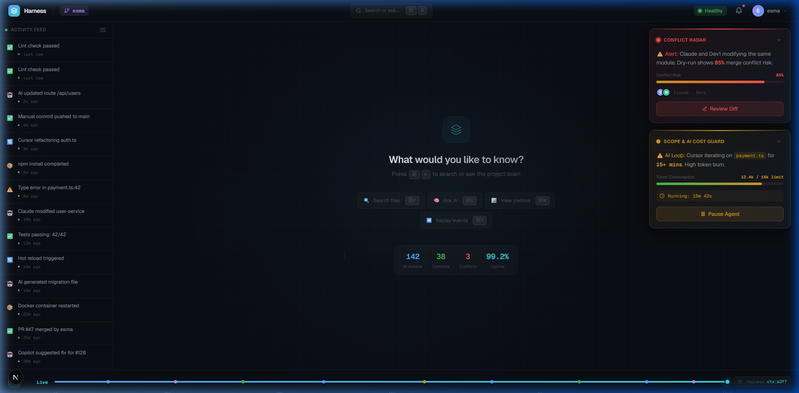
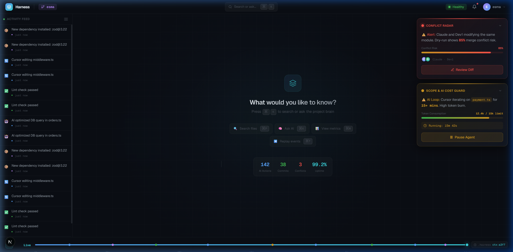
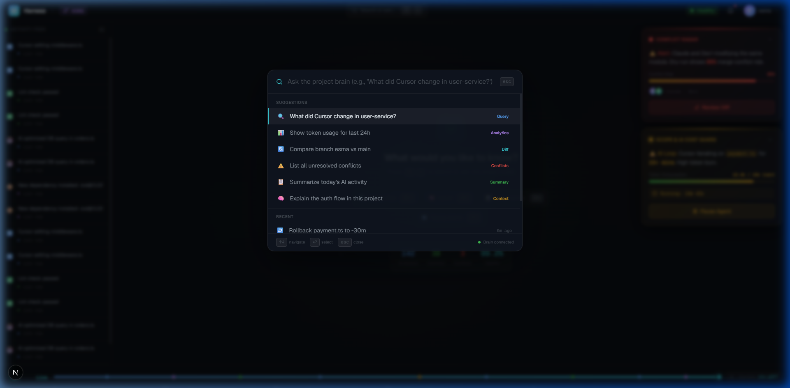
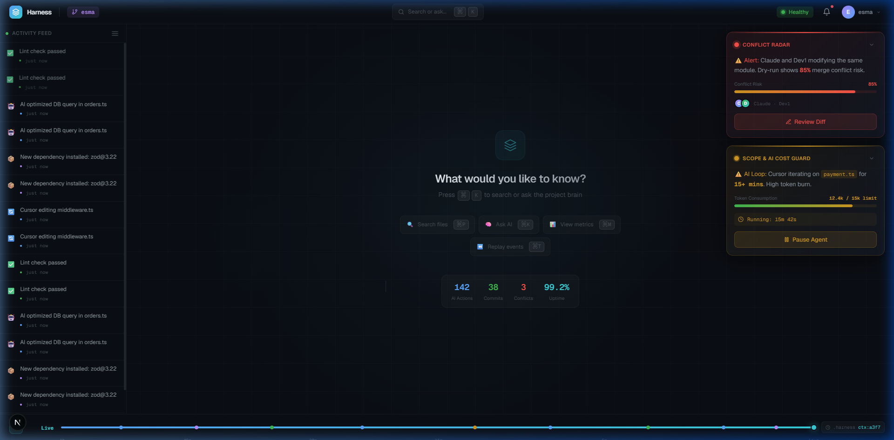
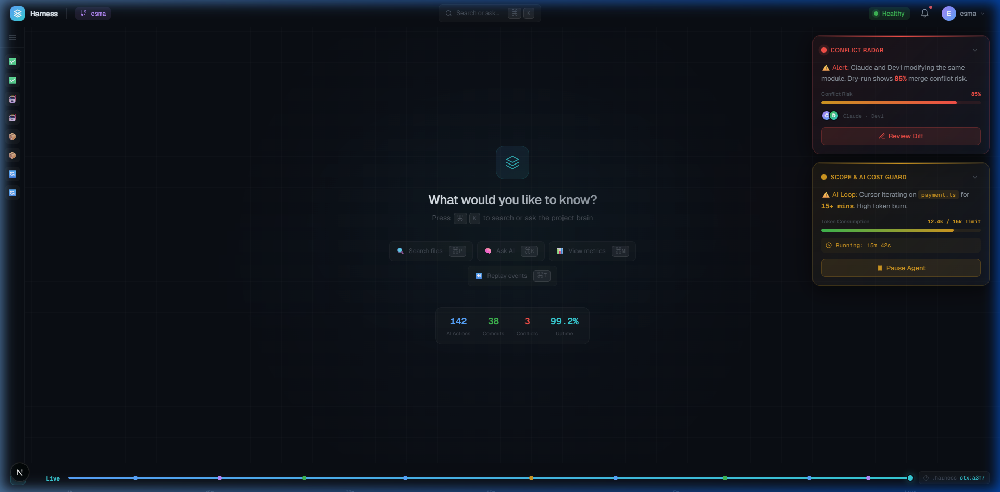

# harness-dashboard — olay güdümlü komuta merkezi

> Bir yazılım ekibi hızlandıkça — özellikle herkes kendi yapay zekâ asistanıyla kod yazarken — kimin ne yaptığını takip etmek zorlaşır. **harness-dashboard**, ekibin çalışmasını izleyip herkese tek bir ortak panoda *"kim neye dokunuyor, kimler çakışmak üzere, nerede plandan sapıldı"* bilgisini gösteren paylaşılan bir **komuta merkezidir**.

---

## Ekran görüntüleri

### Genel pano — tüm bileşenler bir arada



### Uyarı kartları — çakışma radarı ve maliyet koruması (yakın çekim)



### Komut paleti — projenin beynine sor



### Zaman makinesi — alt şeritteki olay tekrarlama çubuğu



### Daraltılmış kenar çubuğu — yalnızca simgeler



---

## Ekip sunumu / anlatım metni

Arkadaşlar selam, Fatih'in harness-dashboard reposunda oluşturduğu temel yapıyı inceledim. Ortak bağlamı (`.harness`) görselleştirmek için çok sağlam bir başlangıç olmuş. Ben de bugün kendi frontend sunumumda, bu mevcut dashboard yapısını alıp nasıl tam otonom bir **"Komuta Merkezine"** dönüştürebiliriz konusuna odaklandım.

Dashboard'u tasarlarken felsefemiz **"Sıfır Gürültü, Maksimum Farkındalık"** olmalı. Yani repodaki o temel yapıyı korurken, ekranı sürekli bilgiyle boğmak yerine **sadece olay anında tepki veren** bir deneyim kurguladım. Fatih'in oluşturduğu temelin üzerine ekleyebileceğimiz ve benim arayüz prototipimde göreceğiniz kilit geliştirmeler şunlar:

### Sağ üst köşe — radarı simülasyona çevirme

Fatih'in kurguladığı çakışma uyarılarını, ekranın sağ üst köşesine bir **"Kırmızı Bölge"** bileşeni olarak sabitledim. Ama sadece uyarmıyoruz; iki ajan aynı dosyaya girdiğinde sistem arkada bunu birleştirip **"%85 ihtimalle söz dizimi hatası çıkacak"** şeklinde net bir kuru çalıştırma sonucu gösteriyor. Etkilenen dosyaları genişletip görebiliyorsunuz — `user-service.ts`, `user.model.ts`, `auth.ts` gibi. "Farkı İncele" butonu ile doğrudan diff ekranına geçiş var.

### Sağ alt köşe — kapsam bekçisi ve döngü kesici

Dashboard'un sağ altını maliyet ve plan kontrolüne ayırdım. Bir yapay zekâ aracı (örneğin Cursor) aynı dosyada takılıp token'ları boşa harcadığında — mesela 15 dakikadır `payment.ts` üzerinde dönüyorsa — burada **sarı bir uyarı** parlıyor. Genişlettiğinizde 23 tekrar, ortalama 540 token/tekrar, toplam tahmini maliyet $0.18 gibi detayları görüyorsunuz. **"Ajanı Durdur"** butonu ile tek tıkla ajanı duraklatabiliyoruz.

### Alt panel — zaman makinesi (olay tekrarlama)

Bence ekleyeceğimiz en havalı şey bu. Sayfanın en altına yatay bir kaydırma çubuğu ekledim. Dashboard'daki verileri anlık görmekle kalmayıp, bu çubuğu geriye çektiğimizde **son 1 saati** arayüzde bir video gibi geri sarabiliyoruz. Zaman çizelgesi üzerindeki renk kodlu noktalar hangi olayın ne zaman gerçekleştiğini gösteriyor — mavi yapay zekâ işlemleri, yeşil elle yapılan işlemler, mor sistem olayları. Kod patladığında, hangi yapay zekânın neyi bozduğunu görsel olarak izliyoruz.

### Merkez — komut çubuğu

Ekranın ortasını tamamen temiz bırakıp her şeyi **`Ctrl+K`** ile açılan bir arama çubuğuna bağladım. *"Ben yokken auth.ts'de ne değişti?"* yazdığımızda, dashboard ilgili logları önümüze getiriyor. Öneriler renk kodlu etiketlerle ayrılıyor: Sorgu, Analiz, Fark, Çakışmalar, Özet, Bağlam. Son kullanılan sorgular da bir alt bölümde listeleniyor.

### Sol kenar çubuğu — canlı aktivite akışı

Sol tarafta her 5 saniyede otomatik güncellenen bir olay günlüğü var: *"🤖 AI route güncelledi"*, *"✅ Elle commit gönderildi"*, *"⚠️ payment.ts:42'de tip hatası"* gibi. Her olay tipi renk kodlu — mavi (yapay zekâ), yeşil (elle), mor (sistem), sarı (uyarı). Kenar çubuğu daraltılabilir; daraltıldığında sadece simgeler görünür, ekran alanı genişler.

### Üst çubuk — minimal ama bilgi dolu

Dal adı (`esma`) mor bir etiketle gösteriliyor. Sağ tarafta nabız atan yeşil noktayla **"Sağlıklı"** durumu, bildirim ikonu ve kullanıcı profili var. Ortada `⌘K` kısayolu hatırlatması — tüm etkileşim oradan başlıyor.

---

**Özetle**, repodaki mevcut dashboard kodumuzu alıp, bu bölgesel uyarı sistemi ve zaman makinesi mantığıyla Next.js üzerinden gerçek zamanlı konuşan çok daha **proaktif** bir arayüze çevirmeyi öneriyorum. Yukarıdaki ekran görüntüleri de tam olarak bu yapıyı gösteriyor.

---

## Teknoloji

| Katman | Teknoloji |
|---|---|
| Çatı | Next.js 16 (Uygulama Yönlendiricisi + Turbopack) |
| Dil | TypeScript |
| Stil | Tailwind CSS 4 + özel CSS değişkenleri |
| Yazı tipi | Geist Sans & Geist Mono |
| Tema | Koyu mod (slate/zinc) + cam efekti |

---

## Proje yapısı

```
harness-dashboard/
├── app/
│   ├── components/
│   │   ├── Navbar.tsx          # Üst gezinme çubuğu
│   │   ├── Sidebar.tsx         # Sol aktivite akışı (daraltılabilir)
│   │   ├── CommandPalette.tsx   # Komut paleti (Ctrl+K arama)
│   │   ├── AlertPanel.tsx       # Sağ taraf uyarı kartları
│   │   ├── ZenCenter.tsx        # Orta alan — hızlı eylemler + istatistikler
│   │   └── TimeMachine.tsx      # Alt zaman çizelgesi
│   ├── globals.css              # Tasarım sistemi ve animasyonlar
│   ├── layout.tsx               # Kök düzen
│   └── page.tsx                 # Ana sayfa — tüm bileşenleri birleştirir
├── docs/                        # Ekran görüntüleri
└── package.json
```

---

## Çalıştırma

```bash
cd harness-dashboard
npm install
npm run dev
```

Tarayıcıda [http://localhost:3000](http://localhost:3000) adresini açın.
