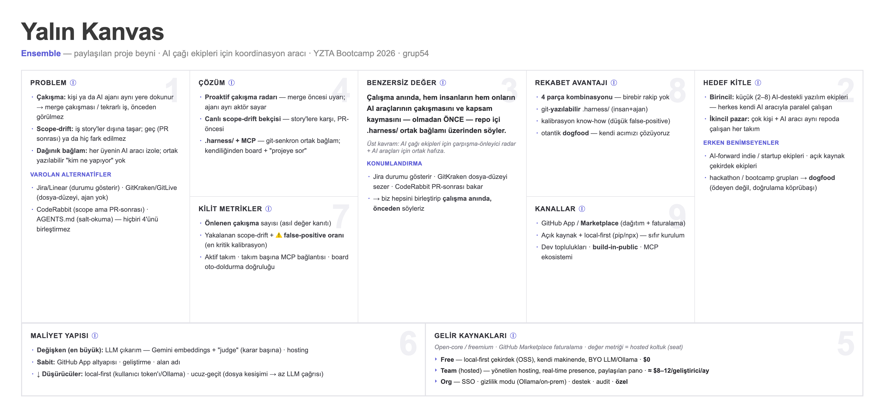
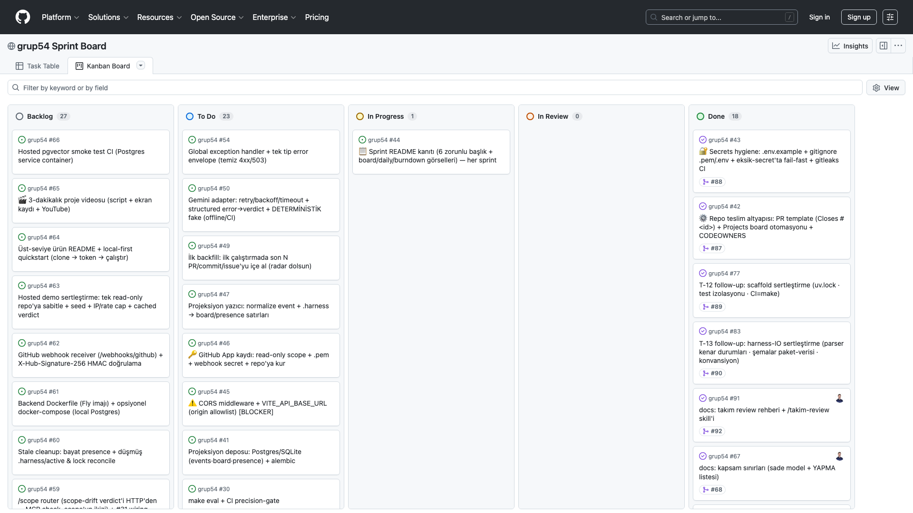
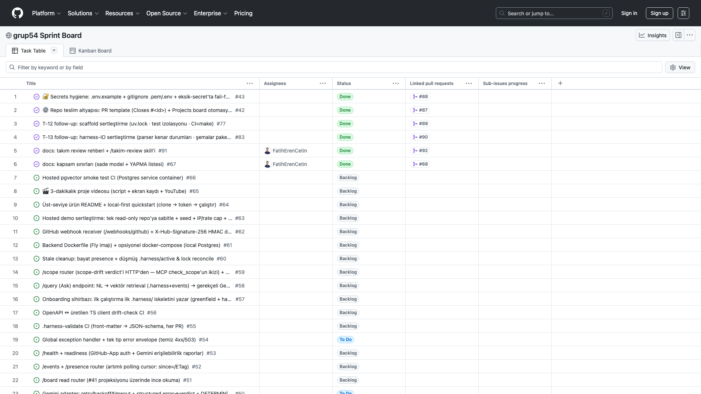
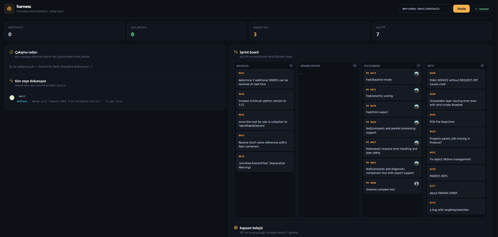
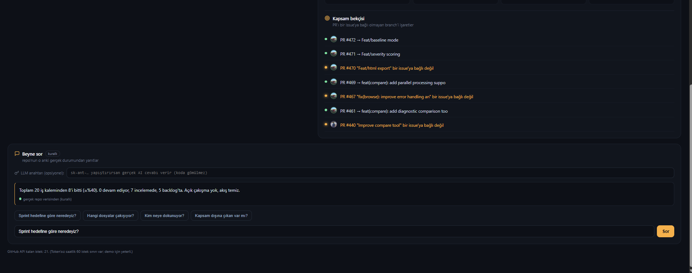
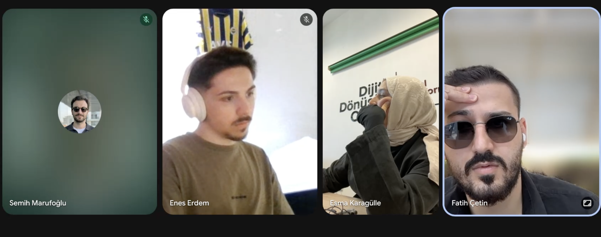
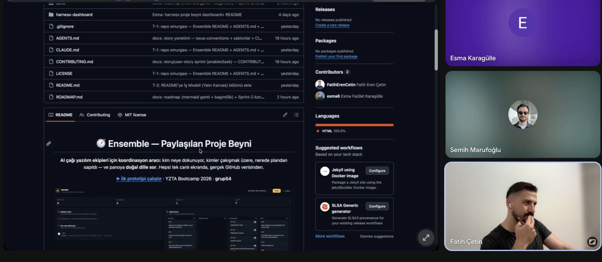
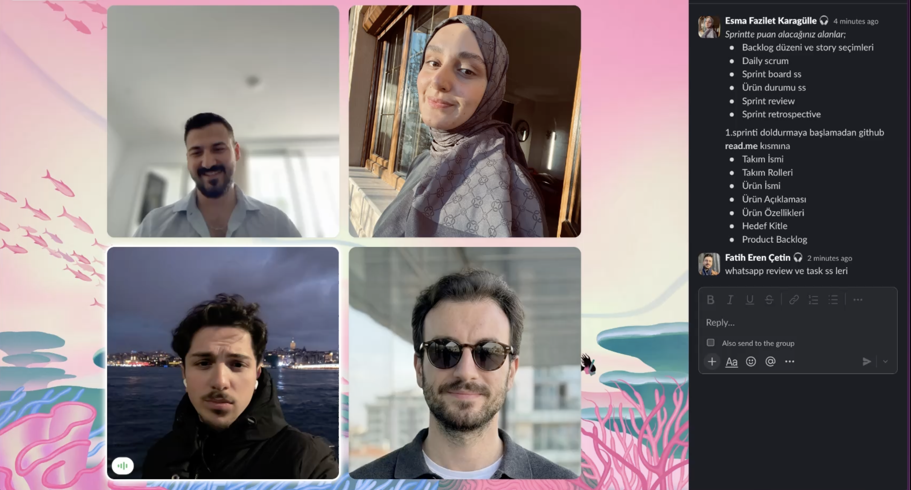
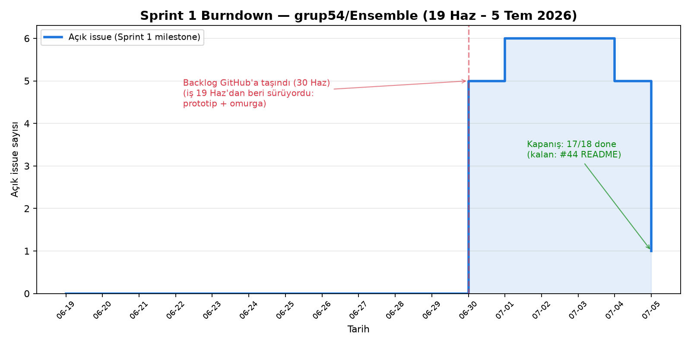

<!-- PUBLIC README — canlı reponun (FatihErenCetin/grup54) köküne koy, mevcut ŞABLON README'nin yerine. -->

# **Grup 54**

### 🧭 Ensemble — Paylaşılan Proje Beyni

**AI çağı yazılım ekipleri için koordinasyon aracı:** kim neye dokunuyor, kimler çakışmak üzere, nerede plandan sapıldı — ve panoya **doğal dille sor**. Hepsi tek canlı ekranda, gerçek GitHub verisinden.

[**▶ İlk prototipi çalıştır**](harness-dashboard/README.md#çalıştırma) · YZTA Bootcamp 2026 · **grup54**

> **İlk prototip:** [`harness-dashboard/`](harness-dashboard/) — vizyonun çalışan bir kesiti. Ensemble'ın tam mimarisi (FastAPI engine · Gemini "judge" · MCP · `.harness/`) geliştiriliyor.

---

# Ürün İle İlgili Bilgiler

## Takım Elemanları

| | İsim | Rol | GitHub | LinkedIn |
|:---:|---|---|:---:|:---:|
|  | **Fatih Eren Çetin** | Product Owner · Developer | [@FatihErenCetin](https://github.com/FatihErenCetin) | [in/fatih-eren-cetin](https://www.linkedin.com/in/fatih-eren-cetin/) |
|  | **Esma Fazilet Karagülle** | Scrum Master · Developer | [@esma6](https://github.com/esma6) | [in/esma-karagulle](https://www.linkedin.com/in/esma-karagulle/) |
|  | **Enes Talha Erdem** | Developer | [@EnesErdemT](https://github.com/EnesErdemT) | [in/enesterdem](https://www.linkedin.com/in/enesterdem/) |
|  | **Semih Marufoğlu** | Developer | [@asmarufoglu](https://github.com/asmarufoglu) | [in/asmarufoglu](https://www.linkedin.com/in/asmarufoglu/) |

> Roller bootcamp boyunca sabittir; **PO ve SM dahil herkes kod yazar.** Ekip içi iletişim kuralı: birincil **SM (Esma)**, yedek **PO (Fatih)**.

---

## Ürün İsmi

**Ensemble** *(çalışma adı)* — AI çağı yazılım ekipleri için paylaşılan proje beyni. İlk prototipin çalışma adı: *harness*.

## Ürün Açıklaması

Bir ekip hızlandıkça — özellikle herkes kendi AI asistanıyla kod yazarken — kimin ne yaptığını takip etmek zorlaşır: aynı iş tekrarlanır, insanlar birbirinin koduna dokunup çakışır, iş kapsamın dışına taşar. **Ensemble**, ekibin GitHub'daki **canlı** çalışmasını izleyip bunları tek ortak panoda gösterir. *(Sahte/mock veri yok — gerçek branch, PR ve issue'lar okunur.)*

## Ürün Özellikleri

- **🎯 Çakışma radarı** — aynı dosyaya dokunan birden fazla branch'i, merge çakışması yaşanmadan **önce** yakalar.
- **👀 Kim neye dokunuyor** — her branch'in son commit'i, yazarı, mesajı canlı.
- **📋 Kendiliğinden dolan sprint board** — issue/PR'lar otomatik Backlog → Devam → İncelemede → Bitti.
- **🛡️ Kapsam bekçisi** — issue'ya bağlı olmayan PR'ları işaretler (plan dışı işi görünür kılar).
- **💬 Beyne sor** — doğal dille soru, repo'nun gerçek verisinden yanıt.

▶ Çalıştırma (tek dosyalık HTML, kurulum yok) ve tüm detaylar: **[`harness-dashboard/README.md`](harness-dashboard/README.md)**

## Hedef Kitle

- Küçük yazılım ekipleri (özellikle AI destekli kod yazan)
- Öğrenci / bootcamp ekipleri
- Birden çok kişinin **ve AI aracının** aynı repoda paralel çalıştığı her takım
- **Tek geliştirici, aynı anda birden çok AI aracı/ajan çalıştıran** (solo multi-agent)

---

## 🧠 Mimari & Yapay Zeka

Ensemble, **insanların** (web pano) ve **her üyenin AI aracının** aynı paylaşılan bağlamı görmesi için tasarlandı. Yapay zekâ bir süs değil, ürünün karar katmanı. İki katman var — karıştırmamak için ayrı tablolar:

**1) İlk prototip — [`harness-dashboard/`](harness-dashboard/)** *(tek-dosya HTML; canlı GitHub verisiyle bugün çalışıyor — vizyonun kanıtı)*

| Yetenek | Durum |
|---|---|
| Çakışma radarı — **dosya-kesişimi** tespiti | 🟢 prototipte çalışıyor |
| Kendiliğinden dolan board + kapsam bekçisi | 🟢 prototipte çalışıyor |
| Beyne sor — kurallı mod (anahtarsız) | 🟢 prototipte çalışıyor |
| Beyne sor — AI modu (opsiyonel anahtar) | 🟢 prototipte çalışıyor |

**2) Ensemble motoru — hedef mimari** *(Sprint 1'de iskelet kuruldu; zekâ Sprint 2'de doluyor)*

| Bileşen | Durum |
|---|---|
| FastAPI engine iskeleti — `/health` · `/radar` · `/scope` · `/board` · `/query` endpoint'leri + port/adapter katmanı | 🟢 iskelet çalışıyor (22 test, CI) — **iş mantığı henüz yok, S2'de** |
| `.harness/` IO — `HarnessPort` (şema doğrulamalı okuma/yazma) | 🟢 çalışıyor |
| **Semantik çakışma + scope-drift** — embeddings + Gemini **"judge"** + eşik kalibrasyonu/eval | 🔨 Sprint 2 (geliştiriliyor — ürünün kalbi) |
| GitHub ingest — App auth + polling | 🔨 Sprint 2 |
| React web pano (Radar · Board · Ask) | 🔨 Sprint 2 |
| **MCP arayüzü** — AI araçları ortak bağlamı okur/yazar | 🟡 Sprint 3 |
| Hosted demo (+ long-reach: üyelik) | 🟡 Sprint 3 |

Hedeflenen motor: **Python + FastAPI** (engine) · **Gemini** (embeddings + judge) · **MCP server** · **GitHub App** (webhook). Çalışma modu local-first; demo için tek hosted örnek.

---

## 💼 İş Modeli

Tam **Yalın Kanvas** (9 blok) — vizyon + rakip araştırmasından damıtıldı:

> **Özet:** **Source-available çekirdek** (kaynak görünür, kullanım kısıtlı — OSI open source *değil*; PolyForm Strict) + hosted Team ≈ $8–12/geliştirici/ay · **open-core = doğrulama sonrası gelecek opsiyonu 💡** (relicense yolu açık) · hedef = AI-destekli küçük ekipler (öğrenci/bootcamp = dogfood köprübaşı) · **rekabet avantajı** = 4 koordinasyon parçasının (proaktif çakışma + canlı scope-drift + insan & ajan ortak farkındalık + git-yazılabilir `.harness/`) birleşimi — birebir rakip yok. Detay: [`yalin-kanvas.md`](ProjectManagement/General/yalin-kanvas.md).

---

## Product Backlog URL

[**GitHub Projects — grup54 Sprint Board**](https://github.com/users/FatihErenCetin/projects/1) *(public — issue/PR durumundan kendiliğinden dolar; ürünün "kendiliğinden dolan board" vaadinin dogfood'u)*

> Sprint raporları aşağıdadır (**tek-durak**: 6 başlık + görsel kanıtlar bu sayfada). Kanıt dosyaları: [`ProjectManagement/`](ProjectManagement/) · [kanıt haritası](ProjectManagement/README.md).

---

# Sprint 1

> **Tarih:** 19 Haziran – 5 Temmuz 2026 · **Takım:** grup54 (PO Fatih Eren Çetin · SM Esma Fazilet Karagülle · Dev Enes Talha Erdem · Dev Semih Marufoğlu) · **Ürün:** Ensemble — AI-çağı yazılım ekipleri için "paylaşılan proje beyni" (proaktif çakışma radarı · canlı scope-drift bekçisi · kendiliğinden dolan board · doğal dille "projeye sor").

- **Sprint Notları**:

**Sprint hedefi:** Ensemble'ın temelini atmak. Bu sprintte üç şeye odaklandık: (1) ürün vizyonunu **çalışan bir UI prototipiyle** somutlaştırmak, (2) ekibin paralel çalışabilmesi için **repo omurgasını ve süreç sözleşmelerini** kurmak, (3) AI çekirdeğinin üzerine inşa edileceği **kod temelini (foundation)** başlatmak. Sprint 1 kasıtlı olarak **kapsam + iskelet + ilk kanıt** sprintidir; ağır AI çekirdeği Sprint 2'ye planlanmıştır (bkz. Backlog Dağıtma Mantığı).

**Tahmin edilen puan:** `[SM doğrula]`
<!-- SM: Sprint hedefi olarak planlanan toplam story puanı (GitHub Projects'ten) buraya yazılacak; hedef-vs-gerçekleşen karşılaştırması Sprint Review bölümünde verilecek. -->

**Bu sprintte alınan teknik/süreç kararları (kısa özet)**

- **Ürün adı = Ensemble.** Konumlandırma: local-first "paylaşılan proje beyni".
- **Değerlendirme kategorisi = YZ (Yapay Zeka).** Yapay zeka öğeleri en büyük puan kaldıracı olduğu için yol haritası buna göre önceliklendirildi.
- **Mimari yön = local-first (A).** Çok-kullanıcılı/bulut senaryosu (B) bootcamp sonrasına bırakıldı. Ortak bağlam repo içi `.harness/`'ta tutulur (git-senkron); Gemini embeddings + LLM judge ile çalışır; yığın FastAPI + React + MCP.
- **İlk dedektör = çakışma radarı.** Dosya-kesişimi sinyaliyle başlanır; scope-drift ve diğer dedektörler sonraki sprintlere planlandı.
- **Süreç sözleşmesi = `AGENTS.md` + `CONTRIBUTING`.** Git kuralı: `T-<id>` branch · `Closes #<id>` · merge commit · Conventional-lite mesaj · yazar = işi fiilen yapan kişi. Issue/story yönetimi şablona bağlandı (label: story = 🔵, task = 🔴; milestone = sprint; epic = alan).
- **Board aracı = GitHub Projects** (Backlog · To Do · In Progress · In Review · Done + otomasyon), görsel ayna olarak **Miro** kanban.
- **Daily ritmi = geliştirme günlerinde, async** (WhatsApp; ileride Slack'e taşınması planlanıyor).

**User story'ler nerede tutuluyor:** Tüm user story ve task'lar **GitHub Issues**'ta yönetilir. Story'ler "*Bir <rol> olarak <istek> istiyorum, böylece <fayda>*" formatında yazılır; story/task label'ı taşır ve ilgili **sprint milestone**'una bağlanır. Sprint 1 backlog'u 5 epic (engine · ai · mcp · frontend · infra) → 32 story → ~150 task olarak yapılandırıldı ve süzülerek **58 GitHub issue**'ya indirgendi.

**Kullanılan araçlar:**

| Araç | Kullanım |
|---|---|
| **GitHub** | Repo, Issues (user story / backlog), Projects (kanban board + otomasyon) |
| **Miro** | Board'un görsel ayna kanbanı |
| **WhatsApp** | Günlük scrum (daily, async (sabit saat yok)) — kanıt `ProjectManagement/Sprint1/DailyScrum/` `[SM doğrula]` |
| **AI araçları** (Claude Code vb.) | AI-destekli geliştirme + backlog/doküman taslaklama |

> Çalışan ürün (UI prototipi) ekran görüntüleri: `ProjectManagement/Sprint1/Screenshots/` · Board görselleri ve renk kodu: `ProjectManagement/Sprint1/Board/`

---

- **Backlog düzeni ve Story seçimleri**:

Ürün backlog'umuz, ürünü dört çekirdek özelliğe (çakışma radarı · scope-drift bekçisi · kendiliğinden dolan board · "projeye sor") indirip bunları **5 epic** altında topladıktan sonra oluştu: `engine` · `ai` · `mcp` · `frontend` · `infra`. Bu epic'ler önce 32 story'ye, ardından ~150 task'a bölündü; coverage audit ("bağlantı dokusu" boşlukları: CORS, projeksiyon yazıcı, GitHub App kaydı, eval vb.) sonrası süzülerek **58 GitHub issue** olarak işaretlendi. Story'ler **GitHub Issues** üzerinde "Bir `<rol>` olarak `<istek>` istiyorum, böylece `<fayda>`" formatında tutuluyor; her issue `story` (🔵) / `task` (🔴) label'ı, `sprint` milestone'u ve `epic` (alan) etiketi taşıyor.

**Üç sprinte dağıtım gerekçesi**

Dağıtımı **değerlendirme kaldıracı** (YZ kategorisi: yapay zeka öğeleri 35p) ile **teknik bağımlılık sırası** (önce çalışan zemin, sonra çekirdek, sonra kabuk) birlikte belirledi:

- **Sprint 1 — Foundation + prototip + süreç (bu sprint).** Önce ortak zemini sağlamlaştırdık: repo omurgası (README · AGENTS.md · CONTRIBUTING · issue/story yönetimi), backlog'un kendisi (5 epic → 58 issue + roadmap + Sprint-2 kontratları + kapsam-sınırları), board otomasyonu ve ilk çalışan UI prototipi. **Gerekçe:** AI çekirdeği (S2) `.harness/` IO ve saf çekirdek (pure core) üzerine kurulacağı için bu katman erken bitmeli; ayrıca disiplinli git/board akışını kurmak, sonraki iki sprintin "kendiliğinden dolan board" vaadini kendi repomuzda dogfood etmemizi sağlıyor. GATE 0/1/2 (#12 scaffold → #13 harness-IO → #14 pure core) sıralı şekilde bu sprint içinde tamamlanacak.
- **Sprint 2 — AI çekirdeği (en yüksek kaldıraç).** Çakışma radarının uçtan uca yapay zeka hattı: ingest → embeddings → LLM judge → eval/kalibrasyon. **Gerekçe:** Final değerlendirmede "yapay zeka öğeleri" **35 puan**, ön değerlendirmede YZ modeli seçimi (20) + AI agent/hafıza/orkestrasyon (15) bulunuyor; toplam ~70 puanlık alan doğrudan bu çekirdeğe bakıyor. Bu yüzden en ağır ve en riskli iş, zemin oturduktan hemen sonra ortaya alındı — "süs AI" değil, amaca uygun ve kalibre edilmiş bir dedektör hedefleniyor.
- **Sprint 3 — Kabuk + tamamlama + sunum.** Board/ask kabuğu, scope-drift bekçisi, MCP entegrasyonu, hosted demo ve 3 dakikalık video. **Gerekçe:** Bunlar S2'deki çekirdeğin üzerine oturan kullanıcı-değeri ve sunum katmanı; çekirdek çalışmadan cilalanması anlamsız olurdu, bu yüzden en sona bırakıldı.

**Dağıtım kuralı**

Story bazında tahmini puan **sprint hedefinin yarısını geçmeyecek** şekilde bölündü; böylece tek bir story'nin sprinti domine etmesi engellenip risk dağıtıldı. Hedef vs gerçekleşen puan her sprint sonunda açıkça yazılıyor.

**Hedef vs Gerçekleşen (puan)**

<!-- SM: aşağıdaki tüm rakamlar GitHub Projects/board'dan teyit edilip doldurulacak; toplamlar story puanlarının sprint milestone'larına göre toplamıdır -->

| Sprint | Odak | Hedef puan | Gerçekleşen puan |
|---|---|---|---|
| Sprint 1 | Foundation + prototip + süreç | [SM doğrula] | [SM doğrula] |
| Sprint 2 | AI çekirdeği (çakışma radarı + eval) | [SM doğrula] | — (planlandı) |
| Sprint 3 | Kabuk + scope-drift + MCP + demo/video | [SM doğrula] | — (planlandı) |
| **Toplam backlog** | 5 epic → 58 issue | **[SM doğrula]** | — |

> Backlog'un kanonik kaydı GitHub Issues + GitHub Projects board'undadır (görsel mirror: Miro). Board ekran görüntüleri ve renk kodu için bkz. aşağıdaki "Sprint Board Update" bölümü ve `ProjectManagement/Sprint1/Board/`.
<!-- SM: board screenshot dosya adlarını (ASCII, ISO tarihli) ekle -->

---

- **Daily Scrum**:

> 📁 Günlük kanıt görselleri + tam kronik tablo: [`ProjectManagement/Sprint1/DailyScrum/`](ProjectManagement/Sprint1/DailyScrum/) — [`daily-scrum-log.md`](ProjectManagement/Sprint1/DailyScrum/daily-scrum-log.md) (19 Haz → 5 Tem, kanıt sütunuyla).

Daily scrum'lar **WhatsApp ve Slack** üzerinden **yazılı (async)** yürütülür — **sabit bir saat yoktur**; geliştirme yapılan gün her üye *dün / bugün / blocker* paylaşır.

- Dün ne yaptım?
- Bugün ne yapacağım?
- Önümde engel (blocker) var mı?

**Cadence:** yazılı async — WhatsApp + Slack; yalnızca geliştirme yapılan günlerde.

> **Not:** Ritim iki platformda birden sürer (danışman-dahil Slack + ekip-içi WhatsApp) — ikisi de kanıt olarak toplanır.

**Kanıt:** Daily scrum ekran görüntüleri ve günlük loglar → `ProjectManagement/Sprint1/DailyScrum/`

| Tarih | Öne çıkan başlık | Engel/Karar | Kanıt |
|---|---|---|---|
| <!-- SM: tarih --> | <!-- SM: günün özeti --> | <!-- SM: blocker/karar --> | `DailyScrum/daily-YYYY-MM-DD.png` [SM doğrula] |

<!-- SM: Yukarıdaki tabloyu geliştirme yapılan her gün için doldur. Her satır bir güne karşılık gelir; kanıt dosya adlarını ASCII + ISO tarihli tut (örn. daily-2026-06-24.png). -->

**Doğrulanacaklar [SM doğrula]:**
- Geliştirme yapılan günlerin tam listesi ve her birinin ekran görüntüsü `DailyScrum/` altına commit'lendi mi?
- Görüntülerdeki saat damgaları async (sabit saat yok) ritmiyle tutarlı mı?
- Sprint 1 içinde WhatsApp'tan Slack'e geçiş gerçekleşti mi, yoksa tümüyle WhatsApp'ta mı kaldı? (Üstteki not buna göre netleştirilecek.)

---

- **Sprint board update**:

**Kapanış board'u (5 Tem — kanban):** *(canlı board: [GitHub Projects](https://github.com/users/FatihErenCetin/projects/1) — public)*

📋 Tablo görünümü (Status + bağlı PR kolonlarıyla)

Sprint board'umuzu **iki katmanlı** yürütüyoruz: kanonik akış **GitHub Projects**'te (issue/PR durumundan otomatik beslenir), ekibin tek bakışta gördüğü görsel ayna ise **Miro**'da. İkisi de aynı user story / task'ları yansıtır; GitHub kanonik kaynak, Miro türev görünümdür.

**1. GitHub Projects (kanonik board)**

Kanban kolonları — kılavuzun beklediği akışı kapsar:

| Kolon | Anlamı |
|---|---|
| **Backlog** | Henüz sprint'e alınmamış, önceliklendirilmemiş işler |
| **To Do** | Bu sprint'e alınmış, başlanmamış işler |
| **In Progress** | Aktif geliştirilen işler (assignee atanmış) |
| **In Review** | PR açılmış, review bekleyen işler |
| **Done** | Merge edilmiş / kapanmış işler |

**Otomasyon (dogfood):** Kartlar elle sürüklenmek yerine **issue/PR durumundan otomatik** hareket eder — `T-<id>` branch + PR'da `Closes #<id>` konvansiyonu sayesinde PR açılınca kart *In Review*'a, merge olunca *Done*'a geçer. Bu, ürünümüz Ensemble'ın "kendiliğinden dolan board" vaadini **kendi repomuzda** uyguladığımız anlamına gelir.

> Rejected/iptal işler için ayrı bir kolon yerine GitHub'ın `closed (not planned)` durumu kullanılır; board narratifinde bu kalemler ayrıca not düşülür.

**Renk kodu (kılavuz zorunluluğu):**

- 🔵 **Mavi = Story** (`story` label) — kullanıcı değeri taşıyan üst seviye iş ("Bir <rol> olarak ... istiyorum" formatı)
- 🔴 **Kırmızı = Task** (`task` label) — bir story'yi gerçekleştiren teknik alt iş

Ek olarak her kart, ait olduğu **epic** (engine · ai · mcp · frontend · infra) ve **milestone = sprint** ile etiketlidir; böylece board hem türe (story/task) hem alana göre süzülebilir.

**Kanıt görselleri** → `ProjectManagement/Sprint1/Board/`

- Sprint başı board (snapshot): `[dosya ekle]` <!-- SM: board-2026-06-19-start.png — ASCII ad, ISO tarih -->
- Sprint sonu board (snapshot): `[dosya ekle]` <!-- SM: board-2026-07-05-end.png -->
- Backlog / epic dağılımı görünümü: `[dosya ekle]`

<!-- SM doğrula: yukarıdaki dosya adlarını gerçekte commit'lenen görsellerle eşle; Product Backlog (Projects) board URL'sini sprint README üst bölümüne ekle. -->

**2. Miro (görsel ayna)**

Ekip planlama ve günlük senkron için Miro üzerinde **görsel bir kanban aynası** tutuyoruz. GitHub Projects mantıksal/otomatik kaynakken, Miro işin **alan bazlı** resmini ("hangi epik ne durumda") tek karede gösterir.

**Miro alan renk kodu** (GitHub'daki story/task ayrımına ek, epic alanını renkle ayırır):

- 🟡 **Sarı = frontend**
- 🟢 **Yeşil = backend**
- 🟣 **Mor = ai**
- 🟦 **Teal = infra**

Bu renkler, Sprint 1'de yaptığımız coverage audit'inde "bağlantı dokusu" boşluklarını (CORS, projeksiyon yazıcı, GitHub App kaydı, eval vb.) görsel olarak işaretlememizi kolaylaştırdı.

**Kanıt görselleri** → `ProjectManagement/Sprint1/Board/`

- Miro board görünümü: `[dosya ekle]` <!-- SM: miro-board-2026-07-05.png -->

<!-- SM doğrula: Miro export görselini repoya commit'le (dış link YOK); dosya adı ASCII + ISO tarihli olsun. -->

**Özet**

| Board | Rol | Kaynak | Renk şeması |
|---|---|---|---|
| **GitHub Projects** | Kanonik, otomatik akış | issue/PR durumu | 🔵 story / 🔴 task |
| **Miro** | Görsel ayna, alan bakışı | elle senkron | 🟡 frontend · 🟢 backend · 🟣 ai · 🟦 infra |

Tüm board kanıtları repoya commit'lenmiştir (`ProjectManagement/Sprint1/Board/`); dış servis linki kullanılmamıştır.

---

- **Ürün Durumu**:

🖼️ Kapsam bekçisi + "beyne sor" görünümü

Sprint 1'in çalışan ürün çıktısı, Ensemble'ın ilk uçtan uca prototipidir: **harness-dashboard** (issue #37). Bu prototip, "AI-çağı yazılım ekipleri için paylaşılan proje beyni" vizyonumuzun dört temel vaadini tek bir ekranda — **gerçek, canlı veriyle** — ilk kez çalışır halde gösterir:

- **Çakışma radarı** — Canlı GitHub REST API'sinden açık dalları/PR'ları çekip dosya-kesişimi üzerinden "kim aynı dosyaya dokunuyor" uyarısını proaktif çıkarır.
- **Kendiliğinden dolan board** — Kart durumlarını elle sürüklemeden, doğrudan issue/PR durumundan türetir (Backlog → In Progress → Done).
- **Kapsam (scope) bekçisi** — Devam eden işin tanımlı sprint kapsamı içinde mi yoksa dışına mı taştığını işaretler.
- **"Beyne sor"** — Proje durumuna doğal dille soru sorulabilen ilk arayüz iskeleti.

> **Bu neden önemli:** Dört vaat de slayt/maket değil, **canlı GitHub verisiyle çalışan bir arayüzde** kanıtlandı. Sprint 1 hedefimiz "ürünü bitirmek" değil, vizyonun teknik olarak mümkün ve değerli olduğunu somut bir prototiple göstermekti — bu karşılandı.

**Prototipten ürüne yol**

harness-dashboard bilinçli olarak **ince bir prototiptir**: mantığın bir kısmı doğrudan istemcide, GitHub API'sine bağlı çalışır; kalıcı bir backend, embeddings tabanlı semantik çakışma tespiti veya Gemini "judge" katmanı henüz yoktur. Bunlar Sprint 2'nin işidir:

- **Sprint 2:** Çekirdek, gerçek bir **FastAPI engine** olarak yeniden inşa edilecek; çakışma radarı dosya-kesişiminden **semantik** tespite (ingest → embeddings → LLM-judge → eval/kalibrasyon) taşınacak. Bu, değerlendirmenin en ağır kaldıracı olan "yapay zeka öğeleri" alanına denk gelir.
- **Sprint 3:** Kabuk (board/ask) olgunlaştırılacak, scope-drift bekçisi ve MCP entegrasyonu eklenecek, hosted demo yayınlanacak.

Yani Sprint 1 prototipi bir "atılacak deney" değil; **doğrulanmış bir referans davranış** — Sprint 2 engine'i bu prototipin gösterdiği akışı, üretim mimarisiyle yeniden üretecek.

**Görseller**

Prototipin çalışan ekran görüntüleri repoya commit'lenmiştir (dış link kullanılmamıştır): `ProjectManagement/Sprint1/Screenshots/`

<!-- SM: Screenshots/ klasörüne çalışan prototipin ekran görüntülerini ASCII adlarla ekle (ör. harness-dashboard-radar-2026-07-05.png, harness-dashboard-board-2026-07-05.png, harness-dashboard-ask-2026-07-05.png) ve aşağıdaki tabloyu gerçek dosya adlarıyla doldur. -->

| Görsel | Ne gösteriyor | Dosya |
|---|---|---|
| Çakışma radarı | Canlı GitHub verisinden dosya-kesişimi uyarısı | `[SM doğrula — dosya adı]` |
| Board | Issue/PR durumundan kendiliğinden dolan kanban | `[SM doğrula — dosya adı]` |
| Kapsam bekçisi | Kapsam içi/dışı iş işaretlemesi | `[SM doğrula — dosya adı]` |
| Beyne sor | Doğal dille proje sorgusu arayüzü | `[SM doğrula — dosya adı]` |

<!-- SM: Mümkünse kısa bir akış GIF'i de ekle (Screenshots/harness-dashboard-demo.gif) — "çalışan ürün" kriterini güçlendirir. -->

---

- **Sprint Review**:

🖼️ Toplantı kanıtları (5 toplantı — katılımcılar görünür)

> Sprint 1 demo ve değerlendirme toplantısı. Çalışan prototip ekip içinde gösterildi, kanıtlar `ProjectManagement/Sprint1/Screenshots/`'ta. Aşağıda sprint boyunca alınan kararlar ve toplantı katılımcıları yer alır.

**Tarih / format:** <!-- SM: review tarihi + platform (yüz yüze / WhatsApp / görüntülü) [SM doğrula] -->

**Demo edilen ürün**

- İlk çalışan UI prototipi (`harness-dashboard`, issue #37): canlı GitHub REST API üzerinden **çakışma radarı** (dosya-kesişimi), issue/PR durumundan **kendiliğinden dolan board**, **kapsam (scope) bekçisi** ve doğal dille **"beyne sor"** akışı gösterildi.
- Ürün durumu ekran görüntüleri: `ProjectManagement/Sprint1/Screenshots/` <!-- SM: ekran görüntüsü dosya adlarını teyit et [SM doğrula] -->

**Sprint 1'de alınan kararlar**

1. **Ürün adı = Ensemble** — "AI-çağı yazılım ekipleri için paylaşılan proje beyni" konumlandırması netleştirildi.
2. **Değerlendirme kategorisi = YZ (Yapay Zeka)** — "No Code" değil. Yapay zeka öğeleri (final 35p) ana puan kaldıracı kabul edildi; çekirdek geliştirme buna göre önceliklendirildi.
3. **Kapsam = A: local-first** — MVP tek geliştirici makinesinde, repo-içi `.harness/` ile çalışır. Çok-kullanıcılı / bulut senaryosu (B) bilinçli olarak **bootcamp sonrasına** ertelendi (kapsam-sınırları + "YAPMA" listesi ile sabitlendi).
4. **İlk dedektör = çakışma radarı** — Ensemble'ın AI çekirdeğinde ilk olarak çakışma radarının (ingest → embeddings → judge → eval/kalibrasyon) geliştirileceği kararlaştırıldı; scope-drift ve MCP write-back sonraki sprintlere bırakıldı.
5. **Backlog yapısı** — 5 epic (engine · ai · mcp · frontend · infra) → 32 story → ~150 task; süzülerek **58 GitHub issue**'ya indirildi. Backlog dağıtımı: S1 = foundation + prototip + süreç, S2 = AI çekirdek, S3 = kabuk + scope-drift + MCP + hosted demo + video.
6. **Board aracı = GitHub Projects (+ Miro)** — kanban kanonik kaynak GitHub Projects (otomasyonlu); Miro görsel ayna olarak kullanılacak.
7. **Cadence = günlük async (sabit saat yok)** — daily scrum WhatsApp üzerinden async (ileride Slack'e taşıma opsiyonu açık).

> Kararların kanıtı: ürün backlog'u ve user story'ler → GitHub Issues (story=🔵 / task=🔴, sprint = milestone); board → GitHub Projects + `ProjectManagement/Sprint1/Board/`. <!-- SM: board screenshot dosya adlarını teyit et [SM doğrula] -->

**Katılımcılar**

- Fatih Eren Çetin (PO) — <!-- [katılım doğrula] -->
- Esma Fazilet Karagülle (SM) — <!-- [katılım doğrula] -->
- Enes Talha Erdem (Developer) — <!-- [katılım doğrula] -->
- Semih Marufoğlu (Developer) — <!-- [katılım doğrula] -->

<!-- SM: katılamayan üye varsa not düş; toplantı kanıtı (ekran görüntüsü/log) eklenecekse Screenshots/ veya DailyScrum/ altına koy [SM doğrula] -->

---

- **Sprint Retrospective**:

Sprint 1 retrospektifi takımın 4 üyesiyle (PO Fatih Eren Çetin · SM Esma Fazilet Karagülle · Dev Enes Talha Erdem · Dev Semih Marufoğlu) [SM doğrula: tarih/saat] yapıldı. <!-- SM: retro kanıtı (ekran görüntüsü/log) → ProjectManagement/Sprint1/DailyScrum/ veya General/ altına ASCII adla commit'le -->

**İyi gidenler (Keep)**

- **Erken çalışan prototip.** Sprint sonunu beklemeden ilk UI prototipi (harness-dashboard, #37) canlı GitHub REST API'den çakışma radarı + kendiliğinden-dolan board + kapsam bekçisi + "beyne sor" akışını uçtan uca gösterdi; ürün vizyonu somutlaştı. Kanıt → `ProjectManagement/Sprint1/Screenshots/`
- **Güçlü süreç omurgası.** Repo omurgası (#38) ile README · AGENTS.md · CONTRIBUTING · issue/story şablonları ve label sistemi (mavi=story 🔵, kırmızı=task 🔴) ilk sprintte oturdu; backlog (5 epic → 32 story → ~150 task, süzülmüş 58 issue) net biçimde dökümante edildi.
- **Önden planlanmış paralelleşme.** Roadmap (Mermaid gantt + bağımlılık) ve Sprint-2 kontratları (port/endpoint girdi-çıktı) sayesinde ekip, sonraki sprintin paralel çalışmasını şimdiden hazırladı.
- **Daily disiplini.** WhatsApp üzerinden async (sabit saat yok) daily ritmi tutuldu. <!-- SM: gerçekleşme oranı + kanıt görselleri → ProjectManagement/Sprint1/DailyScrum/ [SM doğrula] -->

**İyileştirilecekler (Problem)**

- **Foundation gecikmesi.** Foundation iş zinciri (#12 scaffold → #13 harness-IO → #14 pure core) sıralı bağımlılık nedeniyle Sprint 1'in son günlerine sıkıştı; tamamlanma sprint sonuna yaslandı. Risk: gecikme Sprint-2 AI çekirdeğini (35p kaldıraç) öne taşır.
- **Sıralı bağımlılık darboğazı.** GATE 0/1/2 sıralı olduğundan paralel ilerleyemedi; tek bir gecikme tüm zinciri bekletme riski taşıyor.
- **Kanıt toplama dağınıklığı.** Daily/board ekran görüntüleri ve dosya adlandırma standardı sprint boyunca geç netleşti. <!-- SM: hangi günlerin kanıtı eksik → [SM doğrula] -->
- **Kalibrasyon ölçütü tanımsız.** AI çekirdeğin "ne zaman bitti" ölçütü (false-positive eşiği) henüz Definition of Done'a bağlı değil.

**Somut aksiyonlar (sonraki sprint için)**

| # | Aksiyon | Sahip | Ne zaman | Ölçülebilir çıktı |
|---|---|---|---|---|
| R1 | Foundation zincirini (GATE 0/1/2: #12 → #13 → #14) **Sprint-1 bitiminde tamamen kapat**; Sprint-2'ye taşınmasın | Esma+Fatih · Semih · Enes | 4 Tem'e kadar | 3 issue da Done; bağımlı işler açılır |
| R2 | Sprint-2 **kontratlarını (port/endpoint girdi-çıktı) Sprint-2 başında dondur**, sonra paralelleş | PO Fatih | Sprint-2 günü 1 | `shared/` kontratları "frozen" etiketli; herkes bağımsız branch'te ilerler |
| R3 | **Board otomasyonunu aç** (kart akışı: `Closes #<id>` → In Progress/In Review/Done) ve `.harness/` dogfood'unu kanıtla | SM Esma | Sprint-2 günü 1-2 | Kartlar elle değil PR/issue durumundan akıyor; board screenshot'ı bunu gösteriyor |
| R4 | AI çekirdekte **false-positive kalibrasyonunu Definition of Done kapısı yap** (eval/backtest yeşil olmadan story "done" sayılmaz) | Dev'ler + PO | Sprint-2 boyunca | `eval/` precision/recall delta raporu her detektör PR'ında zorunlu |
| R5 | **Daily disiplinini koru (async (sabit saat yok))** + kanıtı her gün anında ilgili klasöre commit'le | SM Esma | Her gün | `ProjectManagement/Sprint2/DailyScrum/` günlük dolu (ASCII, ISO tarihli) |
| R6 | **Kanıt adlandırma standardını sabitle** (ASCII, ISO tarihli, dış link yok) ve sprint başında klasör iskeletini hazır kur | SM Esma | Sprint-2 günü 1 | Eksik/yanlış adlı kanıt sıfır |

> Retro çıktısı: yukarıdaki 6 aksiyon Sprint-2 backlog'una taşındı/issue'landı. <!-- SM: aksiyonların issue numaralarını ekle [SM doğrula] -->

---

- **Burndown Chart** *(bonus)*:

*(bonus puan)* Sprint 1 burndown grafiği, story puanlarının gün bazında kalan iş olarak düşüşünü gösterir; kaynak `.csv` ile birlikte commit'lenir. Kanıt → `ProjectManagement/Sprint1/Burndown/`

`[SM: grafik ekle]` <!-- SM: burndown-sprint1.png + burndown-sprint1.csv dosyalarını ASCII adla commit'le; dış link kullanma. -->

---

# Sprint 2

*(6 – 19 Temmuz 2026)* — **Hedef:** kusursuz çakışma radarı — uçtan uca AI çekirdeği (ingest → embeddings → LLM judge → **false-positive kalibrasyonu/eval**) + web radar sayfası. *(Sprint sonunda 6 başlık burada doldurulacak: Backlog Dağıtma Mantığı · Daily Scrum · Sprint Board · Ürün Durumu · Review · Retrospective + burndown.)*

# Sprint 3

*(20 Temmuz – 2 Ağustos 2026)* — **Plan:** kabuk (board/ask) · scope-drift dedektörü · MCP araçları · hosted demo · 3 dk video · **long-reach (sprint-içi stretch, gate'li):** hosted kullanıcı senaryosu — canlı "GitHub ile gir" + üyelik (#79). *(Sprint sonunda 6 başlık burada doldurulacak.)*

---

## 🛠️ Teknoloji

Bu sürüm: tek-dosya **HTML + JS** (build yok) · **GitHub REST API** (canlı veri). Çalıştırma, "nasıl çalışıyor", yol haritası ve dürüst bilinen sınırlar → **[`harness-dashboard/README.md`](harness-dashboard/README.md)**. Hedeflenen tam mimari için yukarıdaki *Mimari & Yapay Zeka* bölümüne bakın.
