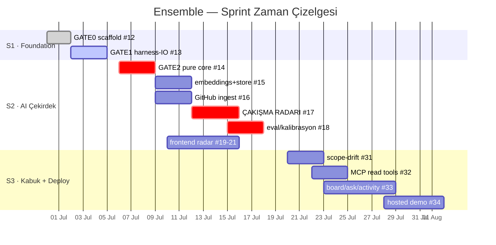
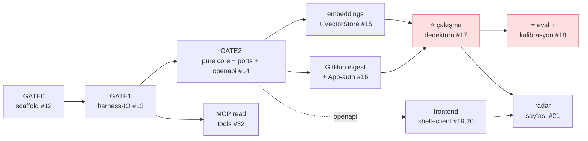

# Ensemble — Yol Haritası (Roadmap)

3 sprint · tam vizyon (FastAPI engine + AI çekirdek + web + MCP). Milestone = **sprint**, epic = **alan**. Canlı takip: [Issues](https://github.com/FatihErenCetin/grup54/issues) · [Board](https://github.com/FatihErenCetin/grup54/projects).

## Milestone'lar (sprintler)

| Milestone | Tarih | Odak |
|---|---|---|
| **Sprint 1** | 19 Haz–5 Tem | harness-dashboard ✓ · repo omurga ✓ · **foundation** (GATE 0/1) |
| **Sprint 2** | 6–19 Tem | **CORE:** GATE 2 + AI çekirdek (embeddings · ingest · **çakışma radarı** · eval) + web radar |
| **Sprint 3** | 20 Tem–2 Ağu | kabuk (board/ask) · scope-drift · MCP write-back · onboarding · hosted demo |

## Zaman çizelgesi

## Bağımlılık akışı (GATE'ler → paralel parçalar)

> **Kritik yol** (kırmızı): foundation → çekirdek → **çakışma dedektörü → eval** → radar. Bu omurga demoable olunca AI değeri (35 puan) kanıtlanır. Geri kalan (frontend·ingest·MCP) **paralel** ilerler — kontratlar (↓) sayesinde kimse beklemez.

## Epic → öne çıkan story'ler

| Epic | Sprint 2 (commit) | Sprint 3 / stretch |
|---|---|---|
| **engine** (backend) | GATE2 #14 · ingest #16 | board+NL · scope-drift #31 |
| **ai** | embeddings #15 · çakışma #17 · eval #18 | model seçimi · scope-drift |
| **frontend** | shell #19 · client #20 · radar #21 | board/ask/activity #33 |
| **mcp** | — | who_is_touching/check_scope #32 · declare_work |
| **infra** | (GATE0/1 #12,13) | hosted demo #34 · onboarding |

## Kontratlar
Bileşenler arası girdi/çıktı arayüzleri (paralel çalışma için): **[`docs/sprint2-kontratlar.md`](docs/sprint2-kontratlar.md)**.

> Detaylı epic→story→task ağacı + araştırma: ekip-içi `internal/grup54_backlog.md`.
