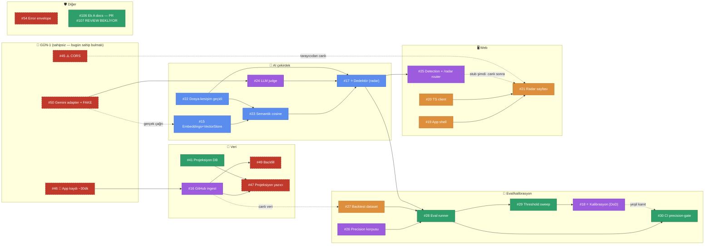

# Sprint 2 — Bağımlılık Haritası & Yürütme Sırası

> **Amaç:** Kim neyi **şimdi** başlatabilir, ne neyi bekler — tek bakışta. Kaynak: issue gövdeleri + `docs/sprint2-kontratlar.md`. Kanonik durum GitHub'dadır; bu doküman *sıralama rehberi*dir (8 Tem 2026).
> **Okuma:** düz ok `A --> B` = *B, A bitmeden canlıya çıkamaz* · kesik ok `A -.-> B` = *yumuşak bağımlılık: B mock/fixture ile beklemeden başlar, canlı için A gerekir* (kontrat-önce ilkesi, D-22).

## 1. Görsel harita (GitHub bu diyagramı render eder)

Renk = sahip: 🔵 Semih · 🟣 Esma · 🟢 Enes · 🟠 Fatih · 🔴 **SAHİPSİZ** (kesikli çerçeve)

## 2. Dalgalar — ne zaman ne başlar

| Dalga | Issue'lar | Not |
|---|---|---|
| **D0 — ŞİMDİ, tamamen paralel** | #46🔑 #45⚠️ #50 (sahipsiz!) · #19 #20 (Fatih) · #22 #15 (Semih) · #16* #26 #25-stub (Esma) · #41 #106→PR107 (Enes) · #27-iskelet (Fatih) · #54 | *#16 fixture'la şimdi başlar; **canlı** auth için #46 şart. #25 router stub'ı kontrattan şimdi yazılır → #21 buna karşı geliştirir |
| **D1 — D0 çıktılarıyla** | #23 (←15+22) · #24 (←50) · #21 (←19+20, mock) · #49 (←16) · #47 (←41+16) | #24, #50 sahiplenilmezse BAŞLAYAMAZ — zincirleme gecikme |
| **D2 — hafta-1 sonu hedefi** | #17⭐ (←22+23+24) · #28 (←26+27+17) | #17 = yürüyen iskeletin kalbi; buraya D8-D9'da varmalıyız |
| **D3 — hafta-2** | #29 (←28) · #25-canlı (←17) · #21-canlı (←25+45) · #30 (←28) | |
| **D4 — sprint kapanış** | #18⭐ (←26..29) | DoD kapısı: eval yeşil değilse "kusursuz radar" iddiası yok |

## 3. Kişi bazlı sıra (herkesin kendi kuyruğu)

| Kişi | Sıra (→ = sonra) | Bekleme notu |
|---|---|---|
| **Semih** | #22 → #15 → #23 → **#17⭐** | Hepsi zincir — Semih kritik yolun sahibi. #15'te gerçek Gemini çağrısı için #50'yi bekleme: fixture'la ilerle |
| **Esma** | #16 + #26 (paralel) → #25-stub → #24 → **#18⭐** | #16 canlı için #46'ya, #24 için #50'ye muhtaç — ikisi de sahipsiz! 5 issue = en yüklü kuyruk; #25-stub'ı öne al ki Fatih beklemesin |
| **Enes** | #106 (PR #107 bugün merge) → #41 → #28 → #29 → #30 | #28'e kadar boşluk olabilir → sahipsiz #50 veya #46 için en uygun aday (kendi seçimi) |
| **Fatih** | #19 → #20 → #21 (mock) → #27 | #21 canlı görüntü için #45+#25 gerek; mock'la sonuna kadar gidilir |

## 4. 🔴 Sahipsiz 6 issue — bugün çözülmeli

| Issue | Aciliyet | Neden |
|---|---|---|
| **#46** 🔑 App kaydı | **BUGÜN** (~30 dk, tarayıcı işi) | #16'nın canlı auth'u ölü; ilk gün yapılmazsa veri şeridi kayar |
| **#45** ⚠️ CORS | **BUGÜN** (küçük) | Yapılmazsa tarayıcı TÜM API çağrılarını bloklar; Fatih hafta-2'de duvara toslar |
| **#50** Gemini adapter+fake | **Bu hafta erken** | #24 judge başlayamaz; #26-30 eval fake'siz flaky = DoD kanıtı çürük |
| #49 Backfill | #16 sonrası | Fresh clone'da radar boş — demo riski |
| #47 Projeksiyon yazıcı | #41+#16 sonrası | Board/presence'ı kimse yazmıyor; UI okuyacak veri yok |
| #54 Error envelope | Ara işi | Küçük; boşluğa gelen alır |

## 5. Düz liste (issue · sahip · bağımlı olduğu · kilitlediği)

| # | Sahip | Bağımlı olduğu | Kilitlediği (blocks) |
|---|---|---|---|
| 15 | Semih | — (soft: #50) | #23 |
| 16 | Esma | **#46** (canlı) | #49 #47 (soft: #27) |
| 17 ⭐ | Semih | #22 #23 #24 | #28 #25-canlı |
| 18 ⭐ | Esma | #26 #27 #28 #29 | sprint DoD |
| 19 | Fatih | — | #21 |
| 20 | Fatih | — | #21 |
| 21 | Fatih | #19 #20 (canlı: #25 #45) | demo |
| 22 | Semih | — | #23 #17 |
| 23 | Semih | #15 #22 | #17 |
| 24 | Esma | **#50** | #17 |
| 25 | Esma | — (stub) · #17 (canlı) | #21-canlı |
| 26 | Esma | — | #28 #18 |
| 27 | Fatih | — (soft: #16) | #28 #18 |
| 28 | Enes | #26 #27 #17 | #29 #30 #18 |
| 29 | Enes | #28 | #18 |
| 30 | Enes | #28 (kanıt: #18) | CI koruması |
| 41 | Enes | — | #47 |
| 45 | 🔴 — | — | #21-canlı |
| 46 | 🔴 — | — | #16-canlı → tüm veri şeridi |
| 47 | 🔴 — | #41 #16 | board/presence UI verisi |
| 49 | 🔴 — | #16 | demo dolu-radar |
| 50 | 🔴 — | — | #24 → #17 · eval determinizmi |
| 54 | 🔴 — | — | hata deneyimi |
| 106 | Enes | PR #107 açık | Ek A kontratının resmileşmesi (#104/#105 çekme adayları) |

> Güncelleme kuralı: sıra/bağımlılık değişirse bu dosyaya PR — kanonik issue durumu her zaman GitHub'dadır (TDK).
