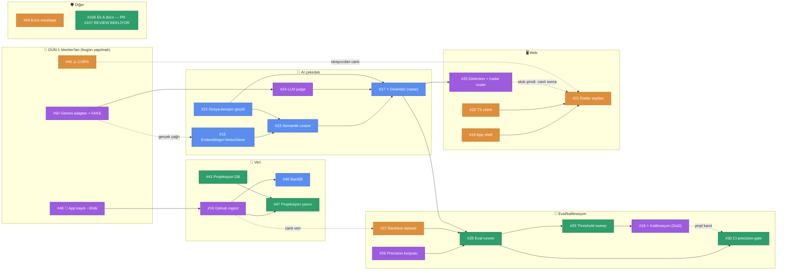

# Sprint 2 — Bağımlılık Haritası & Yürütme Sırası

> **Amaç:** Kim neyi **şimdi** başlatabilir, ne neyi bekler — tek bakışta. Kaynak: issue gövdeleri + `docs/sprint2-kontratlar.md`. Kanonik durum GitHub'dadır; bu doküman *sıralama rehberi*dir (8 Tem 2026 — tüm issue'lar atanmış hâliyle).
> **Okuma:** düz ok `A --> B` = *B, A bitmeden canlıya çıkamaz* · kesik ok `A -.-> B` = *yumuşak bağımlılık: B mock/fixture ile beklemeden başlar, canlı için A gerekir* (kontrat-önce ilkesi, D-22).

## 1. Görsel harita (GitHub bu diyagramı render eder)

Renk = sahip: 🔵 Semih · 🟣 Esma · 🟢 Enes · 🟠 Fatih

## 2. Dalgalar — ne zaman ne başlar

| Dalga | Issue'lar | Not |
|---|---|---|
| **D0 — ŞİMDİ, tamamen paralel** | Esma: **#46🔑 → #50** → #16* + #26 · Fatih: **#45⚠️** + #19 + #20 (+#54 ara işi) · Semih: #22 + #15 · Enes: #106→PR107 merge + #41 · Fatih: #27-iskelet · Esma: #25-stub | *#16 fixture'la şimdi başlar; **canlı** auth için #46 şart. #25 router stub'ı kontrattan şimdi yazılır → #21 buna karşı geliştirir |
| **D1 — D0 çıktılarıyla** | #23 (←15+22, Semih) · #24 (←50, Esma) · #21 (←19+20, mock, Fatih) · #49 (←16, Semih) · #47 (←41+16, Enes) | #24'ün önü Esma'nın kendi #50'sine bağlı → #50'yi öne alması kendi kuyruğunu açar |
| **D2 — hafta-1 sonu hedefi** | #17⭐ (←22+23+24, Semih) · #28 (←26+27+17, Enes) | #17 = yürüyen iskeletin kalbi; buraya D8-D9'da varmalıyız |
| **D3 — hafta-2** | #29 (←28, Enes) · #25-canlı (←17, Esma) · #21-canlı (←25+45, Fatih) · #30 (←28, Enes) | |
| **D4 — sprint kapanış** | #18⭐ (←26..29, Esma) | DoD kapısı: eval yeşil değilse "kusursuz radar" iddiası yok |

## 3. Kişi bazlı sıra (herkesin kendi kuyruğu)

| Kişi | Sıra (→ = sonra) | Bekleme notu |
|---|---|---|
| **Semih** | #22 → #15 → #23 → #49 (kısa, #16 inince) → **#17⭐** | Kritik yolun sahibi — hiç boş kalmaz. #15'te gerçek Gemini çağrısı için #50'yi bekleme: fixture'la ilerle. #49, #23→#17 arasındaki doğal boşluğa oturur |
| **Esma** | **#46 (BUGÜN, ~30 dk)** → **#50** → #16 + #26 (paralel) → #25-stub → #24 → **#18⭐** | ⚠️ **En yüklü kuyruk (7 issue)** ve sprint'in iki ucunda kritik iş (#46 gün-1, #18 kapanış). #46+#50'yi ilk iki günde bitirmek hem kendi #24'ünü hem Semih/Enes'in eval determinizmini açar. Yük ağırlaşırsa #25-stub veya #26 devredilebilir (ekip kararı) |
| **Enes** | #106 (PR #107 bugün merge) → #41 → #47 (←41+16) → #28 → #29 → #30 | #47 araya girince #28'e kadar boşluk kalmadı — akış tam |
| **Fatih** | **#45 (BUGÜN, küçük)** → #19 → #20 → #21 (mock) → #27 → #54 (ara işi) | #21 canlı görüntü için #25+#45 gerek; mock'la sonuna kadar gidilir. #54 küçük — boşluğa gelir |

## 4. 🔴 Gün-1 blocker'ları — sahipli, ama saat işliyor

| Issue | Sahip | Aciliyet | Neden |
|---|---|---|---|
| **#46** 🔑 App kaydı | Esma | **BUGÜN** (~30 dk, tarayıcı işi) | Yapılmadan #16'nın canlı auth'u ölü; ilk gün kayarsa veri şeridi kayar |
| **#45** ⚠️ CORS | Fatih | **BUGÜN** (küçük) | Yapılmazsa tarayıcı TÜM API çağrılarını bloklar; hafta-2 canlı bağlantısı duvara toslar |
| **#50** Gemini adapter+fake | Esma | **Bu hafta erken** | #24 judge başlayamaz; #26-30 eval fake'siz flaky = DoD kanıtı çürük |

## 5. Düz liste (issue · sahip · bağımlı olduğu · kilitlediği)

| # | Sahip | Bağımlı olduğu | Kilitlediği (blocks) |
|---|---|---|---|
| 15 | Semih | — (soft: #50) | #23 |
| 16 | Esma | **#46** (canlı) | #49 #47 (soft: #27) |
| 17 ⭐ | Semih | #22 #23 #24 | #28 #25-canlı |
| 18 ⭐ | Esma | #26 #27 #28 #29 | sprint DoD |
| 19 | Fatih | — | #21 |
| 20 | Fatih | — | #21 |
| 21 | Fatih | #19 #20 (canlı: #25 #45) | demo |
| 22 | Semih | — | #23 #17 |
| 23 | Semih | #15 #22 | #17 |
| 24 | Esma | **#50** | #17 |
| 25 | Esma | — (stub) · #17 (canlı) | #21-canlı |
| 26 | Esma | — | #28 #18 |
| 27 | Fatih | — (soft: #16) | #28 #18 |
| 28 | Enes | #26 #27 #17 | #29 #30 #18 |
| 29 | Enes | #28 | #18 |
| 30 | Enes | #28 (kanıt: #18) | CI koruması |
| 41 | Enes | — | #47 |
| 45 | Fatih | — | #21-canlı |
| 46 | Esma | — | #16-canlı → tüm veri şeridi |
| 47 | Enes | #41 #16 | board/presence UI verisi |
| 49 | Semih | #16 | demo dolu-radar |
| 50 | Esma | — | #24 → #17 · eval determinizmi |
| 54 | Fatih | — | hata deneyimi |
| 106 | Enes | PR #107 açık | Ek A kontratının resmileşmesi (#104/#105 çekme adayları) |
| 108 | Fatih | — | bu doküman (PR #109) |

> Güncelleme kuralı: sıra/bağımlılık değişirse bu dosyaya PR — kanonik issue durumu (atama dahil) her zaman GitHub'dadır (TDK).
