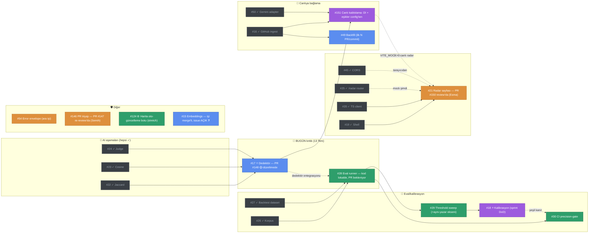

# Sprint 2 — Bağımlılık Haritası & Yürütme Sırası

> **Amaç:** Kim neyi **şimdi** başlatabilir, ne neyi bekler — tek bakışta. Kaynak: issue gövdeleri + `docs/sprint2-kontratlar.md`. Kanonik durum GitHub'dadır; bu doküman *sıralama rehberi*dir.
> **Revizyon: 13 Tem 2026 (sprint-ortası tazeleme, #153)** — 25/37 issue kapandı ✓; #151 (canlı kablolama) ve #146 (PR triyajı) eklendi; #17/#21/#146 PR aşamasında. İlk sürüm: 8 Tem (#108).
> **Okuma:** düz ok `A --> B` = *B, A bitmeden canlıya çıkamaz* · kesik ok `A -.-> B` = *yumuşak bağımlılık: B mock/fixture ile beklemeden başlar, canlı için A gerekir* (kontrat-önce ilkesi, D-22). Gri düğüm = kapandı (yalnız açık işlere zemin olanlar grafikte; tam liste §5).

## 1. Görsel harita (GitHub bu diyagramı render eder)

Renk = sahip: 🔵 Semih · 🟣 Esma · 🟢 Enes · 🟠 Fatih · ⬜ kapandı

**Kritik yol (kalan):** `#148 düzeltme (Semih) → #17 merge → #28 merge (Enes) → #29 → #18⭐ (Esma)` — sprint 19 Tem'de bitiyor, bu zincir **5 iş günü değil 6 takvim günü** içinde kapanmalı. Paralel demo şeridi: `#17 → #151 (Esma) → canlı radar` + `#150 merge → #21 kapanır`.

## 2. Dalgalar — bugünden itibaren (13 Tem)

| Dalga | Issue'lar | Not |
|---|---|---|
| **D0 — ŞİMDİ, paralel** | Semih: **#148 düzeltmeleri** (4 küçük istek — kritik yol!) · Enes: **#28 PR'ını aç** (kod hazır; main'i çek, `conflict_corpus.py`'de main'inkini al) · Esma: #149 atıf düzeltmesi+merge → #150 review · Fatih: #54 | #28 PR'ı #17'yi *beklemeden* açılabilir (dedektör entegrasyonu #17 merge'üyle tamamlanır — kesik ok) |
| **D1 — #148 merge sonrası** | #17 kapanır → Enes #28'i finalize/merge · Esma #151 (canlı DI — eşikler Settings'e) | #151'in sert ön-koşulları (#16 ✓ #50 ✓) hazır; anlamlı canlı radar için #17 gerekir |
| **D2** | Enes: #29 (aynı-yazar ekseni dahil — #29'daki veri notu) + #30 · Fatih: #150 merge → #21 kapanır · Semih: #49 (sığarsa — ❓) | |
| **D3 — kapanış (18-19 Tem)** | Esma: **#18⭐** (eval yeşil = DoD) + sprint 6-başlık raporu | DoD kapısı: eval kabul edilebilir FP göstermeden "kusursuz radar" iddiası yok |

## 3. Kişi bazlı sıra (kalan işler)

| Kişi | Sıra (→ = sonra) | Bekleme notu |
|---|---|---|
| **Semih** | **#148 düzeltmeleri (BUGÜN)** → #17 merge → #49 (❓ sığarsa) → #147 re-review (küçük) | Kritik yol hâlâ onda; #148'in 4 isteği küçük (conflict tek dosya/import + 1 satır default + try/except + TODO). #15'in issue'su kapatılmalı ❓ |
| **Esma** | #149 düzelt+merge → #150 review → **#151** → **#18⭐** | Sprint yine onun kapanışıyla bitiyor; #151 orta boy (DI + Settings eşikleri), #18 eval çıktısına bağlı |
| **Enes** | **#28 PR'ını aç (BUGÜN)** → #17 entegrasyonu → #29 → #30 (+#124 stretch) | Kuyruk tamamen kendi elinde #28 PR'ıyla açılıyor; #124'e ancak #30 sonrası kapasite kalırsa |
| **Fatih** | #54 → #150/#147 merge'leri (onaylar gelince) → sprint raporu girdileri | S2 ana kuyruğu bitti; #54 bağımsız ara işi |

## 4. 🔴 Bugünün blocker'ları

| İş | Sahip | Aciliyet | Neden |
|---|---|---|---|
| **#148 düzeltmeleri** | Semih | **BUGÜN** | Kritik yolun tamamı bunun arkasında; her gün gecikme #28→#29→#18 zincirini sıkıştırıyor (sprint 19'da bitiyor) |
| **#28 PR açılışı** | Enes | **BUGÜN** | Kod lokalde hazır — tek engel main merge + conflict_corpus çözümü; PR açılmazsa review/entegrasyon süresi kapanışa sıkışır |
| **#149 düzelt+merge** | Esma | Bugün (5 dk) | Tek satır atıf düzeltmesi; daily kanıtı taze kalmalı |

## 5. Düz liste (issue · sahip · bağımlı olduğu · kilitlediği)

**Açık işler:**

| # | Sahip | Bağımlı olduğu | Kilitlediği (blocks) |
|---|---|---|---|
| 15 ❓ | Semih | işi merge'li (PR #134) | — (issue kapanışı bekliyor) |
| 17 ⭐ | Semih | #22✓ #23✓ #24✓ · PR #148 🟡 | #28-entegrasyon · #151 · sprint kalbi |
| 18 ⭐ | Esma | #26✓ #27✓ #28 #29 | sprint DoD |
| 21 | Fatih | #19✓ #20✓ · PR #150 review'da | demo (canlı: #151 sonrası bayrak) |
| 28 | Enes | #26✓ #27✓ (soft: #17) | #29 #30 #18 |
| 29 | Enes | #28 (+#29'daki aynı-yazar veri notu) | #18 |
| 30 | Enes | #28 (kanıt: #18) | CI koruması |
| 49 | Semih | #16✓ | demo dolu-radar (❓ S3'e ertelenebilir) |
| 54 | Fatih | — | hata deneyimi |
| 124 ⚙️ | Enes | — (stretch) | süreç otomasyonu |
| 146 | Fatih | PR #147 re-review'da (Semih) | atama otomasyonu |
| 151 | Esma | #16✓ #50✓ (anlamlı: #17) | canlı radar → #21-canlı · demo |
| 153 | Fatih | — | bu doküman (revizyon PR'ı) |

**Kapananlar ✓ (25):** #14 #16 #19 #20 #22 #23 #24 #25 #26 #27 #41 #45 #46 #47 #50 (kod/veri şeridi) · #106 #108 #112 #114 #116 #118 #120 #122 #127 (docs/süreç) · #126 (tasarım)

## ❓ PO'ya sorulacaklar

1. **#15 kapanışı:** T-15 işi PR #134 ile merge'lendi ama issue açık (PR gövdesi `Closes` dememiş olmalı) — kalan alt-iş yoksa kapatılmalı.
2. **#49 (backfill):** Semih'in kuyruğu #148+#17 ile dolu; #49 demo-dolu-radar için *nice-to-have* — sprint sonuna sığmazsa S3'e ertelensin mi?
3. **#124 (harita botu):** stretch — #30 sonrası kapasite kalmazsa S3'e taşınmalı mı?

> Güncelleme kuralı: sıra/bağımlılık değişirse bu dosyaya PR — kanonik issue durumu (atama dahil) her zaman GitHub'dadır (TDK). Sprint kapanışında bu haritadan "akış raporu" üretilecek (`/sprint-akis-raporu`).
