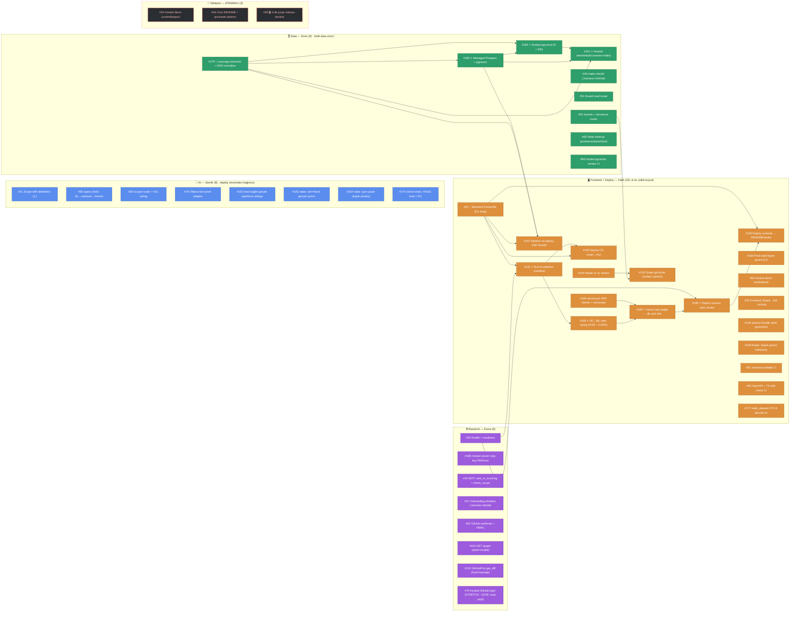

# Sprint 3 — Bağımlılık Haritası & Yürütme Sırası

> **Amaç:** Kim neyi **şimdi** başlatabilir, ne neyi bekler — tek bakışta. Sprint 3 = **go-live** sprinti (20 Tem–2 Ağu): çekirdek radar canlıya çıkar (Fly backend + Vercel frontend + webhook). Kanonik durum GitHub'dadır; bu doküman *sıralama rehberi*dir. Harita ile GitHub çelişirse GitHub kazanır.
> **Sürüm: 20 Tem 2026 (Sprint 3 gün-1 planlaması)** — 47 issue açık, 0 kapandı. Sprint ilerledikçe tazelenir (bkz. rehber §5).
> **Okuma:** düz ok `A --> B` = *B, A bitmeden **canlıya çıkamaz*** (bu sprintte tüm bağımlılıklar sert — deploy zinciri mock'la geçiştirilemez, gerçek image/DB/URL gerekir). Renk = sahip/domain: 🟠 Fatih (frontend+deploy) · 🔵 Semih (AI) · 🟢 Enes (data) · 🟣 Esma (backend) · 🔴 kesikli = sahipsiz. ⭐ = kritik yol · 🔑 = kök (en çok işi açan) · ⚠️ = aşırı yüklü kuyruk.

> ⭐ **DOGFOOD — bu harita ürünümüzle üretildi ve ürünümüz gerçek bir hata yakaladı.**
> Bu bağımlılık grafı elle değil, kendi **#124 (`bagimlilik_uret.py`)** üreticimizle gerçek issue verisinden çıkarıldı. Üretici çalışırken **canlı bir döngü yakaladı: #184 ↔ #185** — PO'nun #184 "Ön-koşul" satırındaki prose-`#185` referansı, #185'in de #184'e bağlı olmasıyla A→B→A oluşturuyordu. Üretici döngüyü işaretledi; yön `#181 → #184 → #185` olarak düzeltildi (fly.toml → wiring → Vercel prod). *"Kendiliğinden dolan / doğrulayan board"* vaadimizin canlı kanıtı — kendi reposunda dogfood.

## 1. Görsel harita (GitHub bu diyagramı render eder)

Renk = sahip/domain: 🟠 Fatih (frontend+deploy) · 🔵 Semih (AI) · 🟢 Enes (data) · 🟣 Esma (backend) · 🔴 kesikli çerçeve = sahipsiz.

**Kritik yol — iki paralel zincir → CANLI:**
- **Veri (Enes):** `#179 🔑 → #182 → #183 → #191` — psycopg sürücüsü olmadan hosted mod DB'ye bağlanamaz; zincirin kökü #179.
- **Deploy (Fatih):** `#61 🔑 → #181 → #184 → #185 → #189` — Dockerfile → fly.toml → wiring → Vercel prod → canlı smoke.

İki zincir **"canlı demo"da buluşur:** #191 (seed) canlı DB'yi gerçek radar verisiyle doldurur, #189 (smoke) deploy'un çalıştığını kanıtlar; #190 (runbook) canlı linki teslime bağlar. **Not:** Web kabuğu (#33 · #180 · #185) backend zincirini **beklemeden** `sample-data` ile erken canlıya çıkabilir (mock modda ilk Vercel linki gün-2'de mümkün); backend zinciri bitince `VITE_API_BASE_URL` gerçek Fly API'sine döner (#184). Bu, demo linkinin sprintin başında görünür olmasını sağlar — kapanışta "hâlâ boş sayfa" riskini keser.

## 2. Dalgalar — bugünden itibaren (20 Tem, gün-1) — İNSAN-KÜRATÖRLÜ

Saf topoloji değil; kök işleri öne çeken, aşırı yükü dağıtan kürasyon. **D0 = gün-1 tamamen bağımsız başlar** (kimseyi beklemez).

| Dalga | Issue'lar | Not |
|---|---|---|
| **D0 — ŞİMDİ, tamamen paralel** | **Enes: #179 🔑** (data zincirinin kökü — BUGÜN) + #48/#51/#52/#60/#66 · **Fatih: #61 🔑** (Dockerfile — kök) + #180 (vercel.json) + #188 (build guard) + #33/#55/#56/#177 · **Esma: #53** (health) + #186 (secret PEM) + #32/#57/#62/#152 · **Semih: #31** (dedektör) + #58 (query) + tüm AI kuyruğu | AI şeridinin tamamı deploy zincirinden **bağımsız** → Semih gün-1'den sona kadar kesintisiz çalışır, kritik yolu bloklamaz. #179 ve #61 aynı gün başlamazsa tüm go-live kayar. |
| **D1 — kökler bitince** | Enes: #179→**#182** (Postgres+pgvector provision) · Fatih: #61+#53→**#181** (fly.toml) · (paralel) #52+#105→#130 (graph modları) | #181 hem #61 (image) hem #53 (health-check ucu) ister → #53'ü D0'da bitir. |
| **D2 — orta halka** | Enes: #182→**#183** (app-boot DI+DDL) · Fatih: #181→**#184** (FE↔BE wiring) → **#185** (Vercel prod, ilk canlı link) · #187 (alembic — #179+#182+#61 ister) · #192 (CD — #61+#181) | #184↔#185 döngüsü düzeltildi (dogfood): sıra #181→#184→#185. #185 ayrıca #180 (SPA rewrite) ister. |
| **D3 — kapanış → CANLI (28 Tem–2 Ağu)** | Enes: #183→**#191** (seed: events+pgvector index) · Fatih: #185+#53→**#189** (canlı smoke) → **#190** (runbook→README) · **teslim: #64 README + #65 video + #34 umbrella** (SAHİPSİZ → ATANMALI) · Esma: #79 (STRETCH, yalnız eval yeşilse) | DoD kapısı: #189 yeşil (canlı /health + readiness + deep-link + CORS) **ve** #191 radarı gerçek veriyle dolu. #65 videosu son güne sıkışmasın diye script D1'de başlamalı. |

## 3. Kişi bazlı sıra (assignee kuyruğu; → = sonra)

| Kişi | Sıra | Bekleme / yük notu |
|---|---|---|
| **Fatih (19) ⚠️ EN YÜKLÜ** | **#61 🔑** → #181 → #184 → #185 → #189 → #190 → #192 (deploy zinciri) · paralel bağımsız: #180 · #188 · #55 · #56 · #177 · #63 · #33 · #105 · #129 · #158 · #130 · #187 | **Darboğaz uyarısı:** deploy kritik yolunun neredeyse tamamı + tüm frontend tek kişide. 19 issue tek sprinte sığmaz. **Devir önerisi (§4):** #187 (alembic) Enes'e (data zinciriyle bitişik), #158/#129 gibi saf-frontend işleri Esma'ya kaydırılabilir. Kök #61 gün-1'de başlamazsa #181/#184/#185/#189/#190/#192/#187 hepsi kayar. |
| **Enes (9)** | **#179 🔑** → #182 → #183 → #191 (kritik data zinciri) · paralel bağımsız: #48 · #51 · #52 · #60 · #66 | Zincir tümüyle kendi elinde; dış bekleme yok. #52 (events router) #130'u (Fatih) besler → erken bitir. #179 go-live'ın data-tarafı kökü: geç kalırsa hosted mod hiç bağlanamaz. |
| **Semih (8)** | #31 → #59 (kendi wiring'i) · #58 (query) · #78 (Ollama) · #162 · #163 · #164 · #170 | **Tamamı deploy zincirinden bağımsız** → kesintisiz paralel çalışır, kimseyi beklemez, kimseyi bloklamaz. AI kalite işleri (#162/#163/#164) çekirdek radar cilası — ürün puanının (35+20+15) kalbi; go-live telaşında ihmal edilmemeli. |
| **Esma (8)** | **#53** (health — deploy kökünü besler, erken) → #186 (secret) · #32 (MCP) · #57 (onboarding) · #62 (webhook) · #104 (/graph) · #152 (get_diff) · #79 (STRETCH, GATE) | #53 ve #186 hosted deploy için ön-koşul niteliğinde (fly.toml health ucu + App key formatı) → gün-1/gün-2. #79 yalnız çekirdek eval yeşilse açılır (issue içi GATE). Fatih aşırı yüklüyse saf-frontend işi buraya kaydırılabilir. |

## 4. 🔴 Blocker'lar & sahipsiz issue'lar

| İş | Sahip | Aciliyet | Neden |
|---|---|---|---|
| **#179 psycopg sürücüsü** | Enes | **GÜN-1** | Data zincirinin kökü; #182/#183/#187/#191 hepsi arkasında. Gecikirse hosted mod DB'ye hiç bağlanamaz → canlı demo boş kalır. |
| **#61 Backend Dockerfile** | Fatih | **GÜN-1** | Deploy zincirinin kökü; #181/#184/#185/#189/#187/#190/#192 arkasında. Fly imajı olmadan hiçbir canlı adım başlamaz. |
| **#53 /health + readiness** | Esma | Gün-1/2 | #181 (fly.toml health-check) ve #189 (smoke) bunu ister; deploy kökünü besler, geç kalırsa Fatih'in zinciri D1'de tıkanır. |
| **#34 Hosted demo (umbrella)** | 🔴 **SAHİPSİZ** | Ata (bugün) | Tüm deploy işinin şemsiye epic'i; sahibi olmadan koordinasyon dağınık. Fatih zaten 19 yüklü → **PO/SM koordinasyon epic'i olarak sahiplenmeli**, alt-taskları (#61/#181/#184/#185…) zaten atanmış. |
| **#65 🎬 3-dk video** | 🔴 **SAHİPSİZ** | Ata + script D1 | Bootcamp **zorunlu teslimi** (2 Ağu). Script erken başlamazsa son güne sıkışır ve kalitesi düşer; ekran kaydı canlı demoyu (D3) bekler ama anlatı/story şimdi yazılabilir. |
| **#64 Ürün README + quickstart** | 🔴 **SAHİPSİZ** | Ata | Jürinin **ilk baktığı** yüzey (`clone → token → çalıştır`). Teslim zorunlu; #190 (runbook) canlı linki buraya bağlar → sahibi #190 ile koordine olmalı. |
| **Fatih aşırı yük (19)** | — | Sprint riski | Tek kişi = tek nokta arıza. §3'teki devir önerileri (alembic→Enes, saf-frontend→Esma) gün-1 planlamada karara bağlanmalı; yoksa deploy zinciri onun kişisel hızına kilitlenir. |

## 5. Düz liste (issue · sahip · bağımlı olduğu · kilitlediği)

Milestone'daki **47 issue** (tümü açık). "Bağımlı olduğu" / "kilitlediği" = #124 üreticisinin doğruladığı **sert** kenarlar; parantezli notlar kuyruk/teslim bağlamıdır (grafikte çizilmez).

| # | Sahip | Bağımlı olduğu | Kilitlediği (blocks) |
|---|---|---|---|
| 31 | Semih | — | — (kuyruk: #59 wiring) |
| 32 | Esma | — | — |
| 33 | Fatih | — | — |
| 34 | 🔴 sahipsiz | — (umbrella) | — (deploy epic'i) |
| 48 | Enes | — | — |
| 51 | Enes | — | — |
| 52 | Enes | — | #130 |
| 53 | Esma | — | #181 · #189 |
| 55 | Fatih | — | — |
| 56 | Fatih | — | — |
| 57 | Esma | — | — |
| 58 | Semih | — | — (kuyruk: #59 tüketir) |
| 59 | Semih | — (kuyruk: #31 wiring · #58) | — |
| 60 | Enes | — | — |
| 61 🔑 | Fatih | — | #181 · #187 · #190 · #192 |
| 62 | Esma | — | — (webhook; canlı için gerekli) |
| 63 | Fatih | — | — (#34 umbrella altında) |
| 64 | 🔴 sahipsiz | — | — (teslim; #190 ile koordine) |
| 65 | 🔴 sahipsiz | — | — (teslim; ekran kaydı D3 canlıyı bekler) |
| 66 | Enes | — | — |
| 78 | Semih | — | — |
| 79 | Esma | — (GATE: eval yeşil) | — (STRETCH) |
| 104 | Esma | — | — (/graph; #105/#130 UI tüketir) |
| 105 | Fatih | — | #130 |
| 129 | Fatih | — | — |
| 130 | Fatih | #52 · #105 | — (stretch) |
| 152 | Esma | — | — (semantik hunk kaynağı) |
| 158 | Fatih | — | — |
| 162 | Semih | — | — |
| 163 | Semih | — | — |
| 164 | Semih | — | — |
| 170 | Semih | — | — |
| 177 | Fatih | — | — |
| 179 🔑 ⭐ | Enes | — | #182 · #183 · #187 · #191 |
| 180 | Fatih | — | #185 |
| 181 ⭐ | Fatih | #53 · #61 | #184 · #192 |
| 182 ⭐ | Enes | #179 | #183 · #187 · #191 |
| 183 ⭐ | Enes | #179 · #182 | #191 |
| 184 ⭐ | Fatih | #181 | #185 |
| 185 ⭐ | Fatih | #180 · #184 | #189 |
| 186 | Esma | — | — (hosted için gerekli; #34 umbrella) |
| 187 | Fatih | #179 · #182 · #61 | — |
| 188 | Fatih | — | — |
| 189 ⭐ | Fatih | #53 · #185 | #190 |
| 190 | Fatih | #61 · #189 | — (canlı link → README/teslim) |
| 191 ⭐ | Enes | #179 · #182 · #183 | — (canlı dolu-radar) |
| 192 | Fatih | #61 · #181 | — |

## ❓ PO/SM'ye sorulacaklar

1. **#34 · #64 · #65 sahipsiz — 3 teslim-kritik issue atanmalı.** #34 koordinasyon epic'i (öneri: PO/SM); #64 README ve #65 video zorunlu bootcamp teslimi (2 Ağu) — bugün sahiplenilmeli, yoksa son güne sıkışır.
2. **Fatih 19 issue = darboğaz.** Devir kararı gün-1'de: #187 (alembic) Enes'e mi (data zinciriyle bitişik)? #158/#129 gibi saf-frontend Esma'ya mı? Deploy zinciri tek kişiye kilitli kalırsa go-live onun hızıyla sınırlanır.
3. **#79 (hosted GitHub-login) GATE:** issue içi kural "çekirdek eval yeşil olmadan başlama". Eval durumu (Semih'in #162) go-live haftasına kadar yeşilse mi açılsın, yoksa S3 sonrasına mı ertelensin?
4. **Erken demo linki:** Web kabuğunu (#185) `sample-data` ile backend'i beklemeden gün-2'de canlıya alalım mı (jüriye erken görünür link), yoksa #184 gerçek-API wiring'ini bekleyip tek seferde mi yayınlayalım?

> Güncelleme kuralı: sıra/bağımlılık değişirse bu dosyaya PR — kanonik issue durumu (atama dahil) her zaman GitHub'dadır (TDK). Sprint kapanışında bu haritadan "akış raporu" üretilecek (`/sprint-akis-raporu`): planlanan sıra vs gerçekleşen, beklemeler nerede oldu → retro girdisi + PM kanıtı.
<!-- BOT-BLOK:baslangic -->
### Sprint 3 — bağımlılık grafı (otomatik üretildi · #124)

> Kanonik durum GitHub'da. Düz ok = sert (canlı ön-koşul) · kesik ok = yumuşak (mock ile beklemeden başlar). `~` = yumuşak bağımlılık.

#### Görsel harita

```mermaid
graph LR
  classDef enes fill:#2e9e6b,color:#fff,stroke:#1d6b47
  classDef esma fill:#9d5bde,color:#fff,stroke:#6b2fb7
  classDef fatih fill:#de8f3c,color:#fff,stroke:#a8641d
  classDef semih fill:#5b8def,color:#fff,stroke:#2f5bb7
  classDef done fill:#3a3f45,color:#9aa3ad,stroke:#565e66
  classDef orphan fill:#2a1f1f,color:#e0a0a0,stroke:#a05252,stroke-dasharray:4 3
  subgraph T_Dier["Diğer"]
    I31["#31 Scope-drift dedektörü (2. dedektö… ✓"]:::done
    I32["#32 MCP: who_is_touching + check_scop… ✓"]:::done
    I33["#33 Frontend: Board + Ask + Activity…"]:::fatih
    I34["#34 Hosted demo: Fly backend + Vercel…"]:::fatih
    I48["#48 make rebuild: DB'yi .harness + Gi…"]:::enes
    I51["#51 /board read router (#41 projeksiy…"]:::enes
    I52["#52 /events + /presence router (artım…"]:::enes
    I53["#53 /health + readiness (GitHub-App a… ✓"]:::done
    I55["#55 .harness-validate CI (front-matte… ✓"]:::done
    I56["#56 OpenAPI ↔ üretilen TS client drif…"]:::fatih
    I57["#57 Onboarding sihirbazı: ilk çalıştı… ✓"]:::done
    I58["#58 /query (Ask) endpoint: NL → vektö… ✓"]:::done
    I59["#59 /scope router (scope-drift verdic… ✓"]:::done
    I60["#60 Stale cleanup: bayat presence + d…"]:::enes
    I61["#61 Backend Dockerfile (Fly imajı) +… ✓"]:::done
    I62["#62 GitHub webhook receiver (/webhook… ✓"]:::done
    I63["#63 Hosted demo sertleştirme: tek rea…"]:::fatih
    I64["#64 Üst-seviye ürün README + local-fi…"]:::orphan
    I65["#65 🎬 3-dakikalık proje videosu (scri…"]:::orphan
    I66["#66 Hosted pgvector smoke test CI (Po…"]:::enes
    I78["#78 Ollama/tam-yerel çıkarım: Embeddi… ✓"]:::done
    I79["#79 Hosted: canlı 'GitHub ile gir' +…"]:::esma
    I104["#104 📊 GET /graph — aktör×modül dokunm… ✓"]:::done
    I105["#105 📊 Radar UI — aktör×modül ısı matr…"]:::fatih
    I129["#129 🧑 /actors/:handle — aktör görünüm…"]:::fatih
    I130["#130 📊 Graph ek görünüm modları: git a…"]:::fatih
    I152["#152 GitHubPort.get_diff: semantik asa… ✓"]:::done
    I158["#158 Radar UI: dusuk-guven tespitleri…"]:::fatih
    I162["#162 eval: runner eşik yolunu gerçek r… ✓"]:::done
    I163["#163 radar: sim=None gerçek ayrımı — '… ✓"]:::done
    I164["#164 radar: aynı-yazar çakışmaları düş… ✓"]:::done
    I170["#170 store/AI: vector-index tamamlayıc…"]:::semih
    I177["#177 🔧 build_dataset.py: git çıktısını…"]:::fatih
    I179["#179 🔌 Backend PostgreSQL sürücüsü (ps…"]:::enes
    I180["#180 🌐 vercel.json: SPA rewrite (deep-… ✓"]:::done
    I181["#181 🚀 fly.toml platform manifesti — c… ✓"]:::done
    I182["#182 🐘 Postgres + pgvector provision (…"]:::enes
    I183["#183 🔗 Hosted app-boot DI: store+pgvec…"]:::enes
    I184["#184 🔀 Frontend↔backend canlı wiring:…"]:::fatih
    I185["#185 ▲ Vercel projesini repo'ya bağla:…"]:::fatih
    I186["#186 🔑 Hosted secret: GitHub App priva… ✓"]:::done
    I187["#187 🗄️ Alembic-on-deploy: hosted kont…"]:::enes
    I188["#188 🧼 Prod build hijyen guard (CI): m… ✓"]:::done
    I189["#189 🔎 Deploy-sonrası canlı smoke: /he…"]:::fatih
    I190["#190 📖 Deploy runbook: env→platform-se…"]:::fatih
    I191["#191 🌱 Hosted seed/rebuild: events + p…"]:::enes
    I192["#192 🤖 Deploy CD: main→Fly backend oto…"]:::fatih
    I206["#206 Dockerfile: DATABASE_URL şeması +…"]:::fatih
    I207["#207 RadarService._compare_cache: bran… ✓"]:::done
  end
  I52 --> I130
  I105 --> I130
  I53 --> I181
  I61 --> I181
  I179 --> I182
  I179 --> I183
  I182 --> I183
  I181 --> I184
  I180 --> I185
  I184 --> I185
  I61 --> I187
  I179 --> I187
  I182 --> I187
  I53 --> I189
  I185 --> I189
  I61 --> I190
  I189 --> I190
  I179 --> I191
  I182 --> I191
  I183 --> I191
  I61 --> I192
  I181 --> I192
```

#### Dalgalar (sert-kenar topolojik seviyeler)

| Dalga | Issue'lar (sahip) |
|---|---|
| D0 | #33 (fatih) · #34 (fatih) · #48 (enes) · #51 (enes) · #52 (enes) · #56 (fatih) · #60 (enes) · #63 (fatih) · #64 (sahipsiz) · #65 (sahipsiz) · #66 (enes) · #79 (esma) · #105 (fatih) · #129 (fatih) · #158 (fatih) · #170 (semih) · #177 (fatih) · #179 (enes) · #184 (fatih) · #192 (fatih) · #206 (fatih) |
| D1 | #130 (fatih) · #182 (enes) · #185 (fatih) |
| D2 | #183 (enes) · #187 (enes) · #189 (fatih) |
| D3 | #190 (fatih) · #191 (enes) |

#### Kişi kuyrukları

| Kişi | Sıra (dalga içi # artan) |
|---|---|
| enes | #48 → #51 → #52 → #60 → #66 → #179 → #182 → #183 → #187 → #191 |
| esma | #79 |
| fatih | #33 → #34 → #56 → #63 → #105 → #129 → #158 → #177 → #184 → #192 → #206 → #130 → #185 → #189 → #190 |
| sahipsiz | #64 → #65 |
| semih | #170 |

#### Uyarılar

**⚠️ Sahipsiz/label'sız (açık):** #64 #65

#### Düz liste

| # | Sahip | Bağımlı olduğu | Kilitlediği |
|---|---|---|---|
| 31 ✓ | semih | — | — |
| 32 ✓ | esma | — | — |
| 33 | fatih | — | — |
| 34 | fatih | — | — |
| 48 | enes | — | — |
| 51 | enes | — | — |
| 52 | enes | — | #130 |
| 53 ✓ | esma | — | #181 #189 |
| 55 ✓ | fatih | — | — |
| 56 | fatih | — | — |
| 57 ✓ | esma | — | — |
| 58 ✓ | semih | — | — |
| 59 ✓ | semih | — | — |
| 60 | enes | — | — |
| 61 ✓ | fatih | — | #181 #187 #190 #192 |
| 62 ✓ | esma | — | — |
| 63 | fatih | — | — |
| 64 | sahipsiz | — | — |
| 65 | sahipsiz | — | — |
| 66 | enes | — | — |
| 78 ✓ | semih | — | — |
| 79 | esma | — | — |
| 104 ✓ | esma | — | — |
| 105 | fatih | — | #130 |
| 129 | fatih | — | — |
| 130 | fatih | #105 #52 | — |
| 152 ✓ | esma | — | — |
| 158 | fatih | — | — |
| 162 ✓ | semih | — | — |
| 163 ✓ | semih | — | — |
| 164 ✓ | semih | — | — |
| 170 | semih | — | — |
| 177 | fatih | — | — |
| 179 | enes | — | #182 #183 #187 #191 |
| 180 ✓ | fatih | — | #185 |
| 181 ✓ | fatih | #53 #61 | #184 #192 |
| 182 | enes | #179 | #183 #187 #191 |
| 183 | enes | #179 #182 | #191 |
| 184 | fatih | #181 | #185 |
| 185 | fatih | #180 #184 | #189 |
| 186 ✓ | esma | — | — |
| 187 | enes | #179 #182 #61 | — |
| 188 ✓ | fatih | — | — |
| 189 | fatih | #185 #53 | #190 |
| 190 | fatih | #189 #61 | — |
| 191 | enes | #179 #182 #183 | — |
| 192 | fatih | #181 #61 | — |
| 206 | fatih | — | — |
| 207 ✓ | sahipsiz | — | — |
<!-- BOT-BLOK:bitis -->
